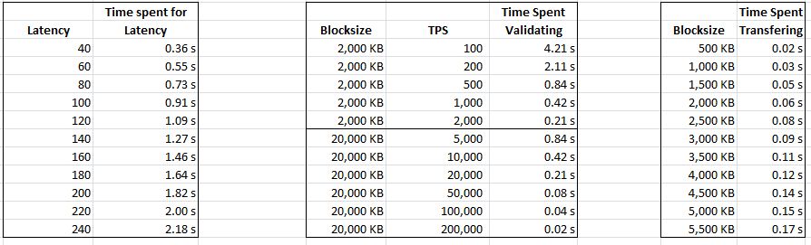

**Status: Ready for Review**

# Intro

Debate about growth of Bitcoin's blockchain has raged for years now. Some want to increase transaction throughput by increasing block size and call that "scaling". Others want to focus on technologies that improve (decrease) the resources necessary to run the network as it grows (actual scaling). It hasn't helped that there are [many misunderstandings](https://medium.com/@thecryptoconomy/7-misunderstandings-of-bitcoins-scaling-problem-c5142e938a68) of where Bitcoin's bottlenecks are.

In this document, I will analyze the major throughput bottlenecks that currently constrain Bitcoin's safe throughput capacity and look into what throughput capacity we can expect in the future. These bottlenecks are all driven by stress put on the machines that make up the Bitcoin network in worst-case adversarial situations.

- [Prior Work](#prior-work)
- [Overview](#overview)
- [The State of Available Machine Resources](#the-state-of-available-machine-resources)
- [Assumptions](#assumptions)
- [SPV Nodes](#spv-nodes)
- [Bottlenecks](#bottlenecks)
  * [Initial Block Download](#initial-block-download)
  * [Initial Sync Validation (without assumevalid)](#initial-sync-validation-without-assumevalid)
  * [Initial Sync Validation (using assumevalid)](#initial-sync-validation-using-assumevalid)
  * [Ongoing Transaction Download & Upload](#ongoing-transaction-download--upload)
  * [Ongoing Validation](#ongoing-validation)
  * [UTXO Set Disk Usage](#utxo-set-disk-usage)
  * [Blockchain & UTXO disk usage](#blockchain--utxo-disk-usage)
  * [UTXO Set Memory Usage](#utxo-set-memory-usage)
  * [Mining Centralization Pressure](#mining-centralization-pressure)
- [Summary of the Current Bottlenecks](#summary-of-the-current-bottlenecks)
- [Potential Solutions](#potential-solutions)
  * [Assume UTXO](#assume-utxo)
  * [Erlay](#erlay)
  * [Proactive Transaction Inclusion in Blocks](#proactive-transaction-inclusion-in-blocks)
  * [Fraud Proofs](#fraud-proofs)
  * [Assume UTXO, Ignore Historical](#assume-utxo-ignore-historical)
  * [Accumulators](#accumulators)
  * [Upgraded SPV Nodes](#upgraded-spv-nodes)
  * [Distributed data storage](#distributed-data-storage)
  * [Emergency Mode](#emergency-mode)
- [Future throughput and capacity needs](#future-throughput-and-capacity-needs)
  * [UTXO Expectations](#utxo-expectations)
  * [Lightning Network contingencies](#lightning-network-contingencies)
- [Future throughput](#future-throughput)
- [Conclusions](#conclusions)
- [Appendix](#appendix-a---derivation-of-initial-block-download-equations)

# Prior Work

LukeJr analyzed sync time and gave [results of his analysis](https://www.youtube.com/watch?v=CqNEQS80-h4) that lowering the blocksize maximum to 300KB would allow us to maintain the current sync time, and would allow sync time to decrease slowly over the years. But [his script](https://github.com/fresheneesz/bitcoinThroughputAnalysis/blob/master/LukeJr's%20sync-time%20script.py) only calculates one bottleneck.

[BitFury's paper on Block Size Increase](https://bitfury.com/content/downloads/block-size-1.1.1.pdf) in 2015 quantified the effect of blocksize on the basis of how many nodes would be excluded from the network. It contains a lot of good info, but their estimate of how many nodes would be excluded is not well justified and doesn't attempt to estimate current or future nodes that are or will be excluded.

# Overview

In order to analyze Bitcoin's maximum throughput, its necessary to choose some support-goals: basically what minimum system requirements do we want Bitcoin to support for various aspects of running the network. Once we choose goals, we can calculate the transaction throughput at which those goals are barely met for each major process necessary for users on the Bitcoin network to do. Here are some considerations:

1. We want as many people as practical to mine bitcoin.
2. We want many people to support the network by passing around transactions and blocks.
3. We want most people to be able to be able to fully verify their transactions so they have full self-sovereignty of their money.
4. We want to be resilient in the face of chain splits. For example, if a majority wants to change bitcoin in a way that a minority thinks is dangerous or compromises the system, its important that minority can maintain the operation of their chain in the face of a majority split.
5. We want to be resilient in the face of attempted eclipse attacks.
6. We want mining to be as fair as possible - ie we want mining reward to scale as close to linearly with hashpower as possible.

We don't need the people with the worst equipment to mine (#1), and we might not even need them to support the network (#2) very much, but we do want them to be able to be able to fully verify their own transactions (#3), and we want them to be able to know what chain they're on (#4).

These considerations are all affected by transaction throughput and blocksize.

\#1 is important to bitcoin, but may be the least affected by increased block size, since miners are generally either large powerful server farms or large mining pools. Miners are unlikely to drop out of bitcoin even if there were many orders of magnitude more transactions (as long as fees held up). However, there is the issue of block propagation time, which has only been partially mitigated with advancements like [compact blocks](https://bitcoincore.org/en/2016/06/07/compact-blocks-faq/).

\#2 is important, but we don't need everyone to do it - just a critical mass. As long as even a small percentage of the network is honest and passes around data, the network can be supported during normal operation. The smaller this percentage, however, the more load nodes that do pass around this data must take on.

\#3 This one is most affected by blocksize changes. SPV nodes are very tempting as they come up almost instantly, don't require any major harddrive space or processor usage, and also give security guarantees somewhat close to full nodes. So the more painful it is to be a full node, the more people are going to use an SPV node instead.

\#4 In the case of a hard fork, SPV nodes won't know what's going on. They'll blindly follow whatever chain their SPV server is following. If enough SPV nodes take payments in the new currency rather than the old currency, they're more likely to acquiesce to the new chain even if they'd rather keep the old rules.

\#5 is relevant because the primary tradeoff for this is that increasing the number of outgoing connections each node makes reduces their suceptibility, but this also increases network load for each node, especially if many nodes are leeching data but not seeding.

\#6 is important because if significantly higher ROI can be gained by joining a large pool or investing in a larger miner, then mining operations will inevitably merge and centralize over time, giving enormous power to the controllers of large mining operations.

Some of the effects of a larger blocksize:

A. Users would need to store more data on their harddrive. This includes both nodes that store the historical blockchain as well as pruning nodes that need to store the UTXO set, since a larger blocksize is likely to mean more growth of the UTXO set (since at the moment, the average transaction creates more outputs than it consumes).

B. Users would need to use more bandwidth to download and upload more data from and to their peers.

C. Users would need to use more of their computer's CPU time and memory to verify transactions.

D. Users who can't do A, B, or C (or feel its not worth it) would not be able to run a full node, and would instead use a less intensive node like an SPV node.

# The State of Available Machine Resources

I will choose system requirements for 90% of the users and for the top 10% of users, but first we need to understand what machine resources are available to people around the world.

## Bandwidth

Taking a look at [the world's lowest ranking peak internet speeds](https://en.wikipedia.org/wiki/List_of_countries_by_Internet_connection_speeds), it gets down to 1.4 Mbps. And according to The International Telecommunication Union, the average bandwidth per user for the lowest ranking countries was around 5 Kbps or lower in 2016[5](https://www.theglobaleconomy.com/rankings/Internet_bandwidth/). While in the future, we definitely would like Bitcoin to be able to reach the poorest of people, currently that's unrealistic, so I'll choose 1 Mbps as the speed available to the 90th percentile Bitcoin user.

The worlds internet speeds are increasing around 25%/year (23% in 2015[6](https://www.akamai.com/us/en/multimedia/documents/content/state-of-the-internet/q4-2015-state-of-the-internet-connectivity-report-us.pdf), 26% in 2016[7](https://www.akamai.com/us/en/multimedia/documents/state-of-the-internet/q4-2016-state-of-the-internet-connectivity-report.pdf), 30% in 2017[8](https://www.speedtest.net/insights/blog/global-speed-2017/)).

## Latency

Latency is another factor that's relevant for time-sensitive data transmission, like propagating newly mined blocks.

It takes light about 65ms to go halfway around the earth, and in fiber optic cable it takes about 100ms[9](https://hpbn.co/primer-on-latency-and-bandwidth/). So one could expect any hop (to another bitcoin node) to have an average of at about 50ms of latency per hop. In reality this is 1.5 to 6 times as long. In addition, last-mile latency is a significant factor adding around 15ms for fiber connections, 25ms for cable connections, and 45ms for DSL[10](https://potsandpansbyccg.com/tag/last-mile-latency/)[11](https://www.igvita.com/2012/07/19/latency-the-new-web-performance-bottleneck/). It gets even worse for mobile phones, but we'll ignore that for our analysis.

All in all, we can expect perhaps around 90ms of latency per hop in the bitcoin network for nodes using fiber, 130ms for nodes using cable, and 250ms for nodes using something else (like DSL).

While we should see last-mile latency improve as more machines move to fiber (and from DSL to cable), it's unlikely we'll see much improvement in latency beyond that, since fiber is about as fast as it gets for light directed through a wire. If we treat 15ms as a near-minimum last-mile latency and assume that most of the reduction in latency in the US between 2010 and 2012 happened at the last mile, then that was actually about a 20% reduction in last-mile headroom latency. This translates to an 11%/year improvement. Outside of the US, there was no improvement in latency at all in those years. So for the purposes of this analysis, I'll use a 4%/year rate of improvement (asymptotically decreasing towards the speed-of-light minimum).

## Hard drive space

I had a hard time finding data for disk space in the world, but I took a look at the [cheapest smartphones you can get in india](https://www.scoopwhoop.com/9-best-budget-smartphones-you-can-get-in-india-in-january-2019/) for an idea. The [Xiaomi Redmi Y2 specs](https://pricebaba.com/mobile/xiaomi-redmi-y2) can be bought for about 8,600 rupees ($120) and has 32GB of storage. This seems like a reasonable amount of storage to expect somone would have even in a poor country, given that you can get a 32GB SD card for $7 these days.

The cost of hard disk space is declining at a rate of about 25% [14](https://www.backblaze.com/blog/hard-drive-cost-per-gigabyte/), tho that rate is slowing.

## CPU speed

I was not able to get good information about CPU speed because it's difficult to know how many transactions a machine with some given specs could validate. I would [be curious](https://bitcoin.stackexchange.com/questions/87864/how-can-i-calculate-estimate-how-quickly-a-machine-can-verify-transactions-on-th) to know more. However, [Eric Kuhn mentioned](https://twitter.com/erickuhn19/status/1095553655086804993) that verifying the transactions can be a much larger bottleneck than downloading them. There are about [415 million transactions](https://www.blockchain.com/charts/n-transactions-total) in the bitcoin blockchain, and if it can take 25 days to verify everything, as Eric Kuhn mentioned, that means his raspberry pi could only verify about 192 tps.

The cost of cpu power is decreasing at less than 20%/year [15](https://www.imf.org/~/media/Files/Conferences/2017-stats-forum/session-6-kenneth-flamm.ashx), so I'll use LukeJr's number of 17%/year for cost of CPU power.

## Memory

As for memory, the Xiaomi Redmi Y2 (which I also used for its disk space specs) has 3 GB of RAM. So we'll use 2 GB for the 90th percentile user [13](https://pricebaba.com/mobile/xiaomi-redmi-y2). Memory has been decreasing in cost by [about 15%/year](https://jcmit.net/memoryprice.htm) (See also [my calculations](memoryCostOverTime.xlsx) on that data).

## An aside about technological growth

The calculations done in this paper assume a constant exponential growth of machine resources for a given cost over time. However, in reality, the rate of growth has been shrinking, so the estimates here will be less accurate and overestimate limits more the further out in time they are extrapolated.

# Assumptions

In order to come up with hard numbers for throughput limits, I'm going to make up some hypothetical support goals and the state of people's computational resources. Bitcoin.org documents the [minimum requirements](https://bitcoin.org/en/full-node#minimum-requirements) for running a full node, however I think we want to substantially lower these requirements so as to make running a full node as accessible as possible to even people in poorer countries.

Not everyone can afford a dedicated node that uses 100% of its bandwidth/cpu/memory on bitcoin. We can reasonably expect that maybe 10% of a machine's resources go to bitcoin on an ongoing basis. During initial sync tho, we can reasonably require a bit more of a machine's processing power, since that's a temporary setup period.

I will use the following hypothetical goals:

I. 90% of Bitcoin users should be able to start a new node and fully sync with the chain (using assumevalid) within 1 week using at most 75% of the resources (bandwidth, disk space, memory, CPU time, and power) of a machine they already own.

II. 90% of Bitcoin users should be able to validate block and transaction data that is forwarded to them using at most 10% of the resources of a machine they already own.

III. 90% of Bitcoin users should be able to validate and forward data through the network using at most 10% of the resources of a machine they already own.

IV. The top 10% of Bitcoin users should be able to store and seed the network with the entire blockchain using at most 10% of the resources (bandwidth, disk space, memory, CPU time, and power) of a machine they already own.

V. An attacker with 50% of the public addresses in the network can have no more than 1 chance in 10,000 of eclipsing a victim that chooses random outgoing addresses.

VI. The maximum advantage an entity with 25% of the hashpower could have (over a miner with near-zero hashpower) is the ability to mine 0.1% more blocks than their ratio of hashpower, even under a 50% sybiled network.

For the purposes of this analysis, I'm going to use the following estimates:

* The 90th percentile of Bitcoin users have 1 Mbps bandwidth, 8 connections, 128GB of disk space, 2 GB of memory, enough cpu power to verify 200 transactions per second, and enough power that it isn't an issue (this assumption should probably be reconsidered).
* The 10th percentile of Bitcoin users have 50 Mbps bandwidth, 88 connections, 1TB of disk space, 8 GB of memory, enough cpu power to verify 5,000 transactions per second, and enough power that it isn't an issue.

*See the "Ongoing Transaction Download & Upload" section for how 88 connections was calculated for the 10th percentile user.*

Most of the bottom 10% that don't fall within these goals can be assumed to use SPV. An SPV node can give its user almost as much security as a full node, even tho it doesn't help the rest of the network.

# SPV Nodes

One obvious question is: why do we need or want most people to run full nodes? One can imagine that since SPV nodes are so cheap to run, maybe it would be acceptable if most people simply used SPV. However there are a number of problems with this as the moment:

* **SPV nodes have [privacy problems](https://eprint.iacr.org/2014/763.pdf)** related to Bloom filters.
* **SPV nodes can be [lied to by omission](https://bitcoin.stackexchange.com/questions/36643/thin-client-remote-node-lying-through-omission)**.
* **SPV nodes have a low number of connections**. Most SPV clients only make four connections to SPV servers.
* **SPV [doesn't scale well](https://www.coindesk.com/spv-support-billion-bitcoin-users-sizing-scaling-claim) for SPV servers** that serve SPV light clients. A fix for this particular problem should appear relatively soon (Neutrino).
* **Light clients don't support the network.** They don't validate blocks or transactions (other than SPV proofs they're passed) so they also don't pass around transactions or block data. However, they do consume resources. This is ok as long as we have a critical mass that do support the network (which is why I chose 10% as the fraction of nodes that do that). But if too big a fraction of the network consists of SPV nodes, then we won't reach that critical mass of full nodes that can adequately support the network.
* **SPV nodes don't know that the chain they're on only contains valid transactions.** They can validate SPV proofs sent to them about transactions they query SPV servers for, and they validate the headers of the longest chain, but if the longest chain contains invalid transactions, an SPV node won't know that. In the case that a majority decide to change the rules of bitcoin in a dangerous way, SPV nodes will blindly follow the new rules as long as they can still validate their SPV proofs. So for a healthy level of decentralization and user-level agency in consensus rules, not too much of the network should consist of nodes that are suceptible to that kind of majority consensus rules change.
* Light clients are fundamentally **more vulnerable in a successful [eclipse attack](https://medium.com/chainrift-research/bitcoins-attack-vectors-sybil-eclipse-attacks-d1b6679963e5)** because they don't validate most of the transactions. Full nodes and light clients can both have nefarious things done to them if they are eclipse attacked. A full node that has been eclipsed can have its outgoing or incoming transactions censored and can be tricked into following a chain with less work than the main chain (by cutting them off from that main chain), which can make it easier to double-spend on them more easily than in a non-eclipse situation (tho perhaps only 2 or 3 times more easily at most). A light client (using Neutrino) that has been eclipsed has those problems as well, but can also be tricked into accepting many kinds of invalid blocks (with about the same level of difficulty as double-spending on an eclipsed full-node).

The last two are most important.

If the vast majority of the network is unable to protect against an invalid longer-chain, then everyone in the network is suceptible to an unwanted and unintentional change of consensus rules, which could potentially leech the majority of wealth onto a less secure branch. SPV nodes don't currently have any way to be aware of most types of consensus rules changes. Imagine 90% of Bitcoin users were using SPV nodes that couldn't tell if the longest chain contains invalid transactions or not. If the majority of miners decide to change the rules and add invalid transactions to their blocks, all of those users would start using that invalid chain. These people would not be moving on purpose, but would accidentally follow this new chain because they have no way of knowing that the chain is invalid. It's possible that enough people would hear about the rules change and understand enough about it to eat any loss (for the day or two they were on the wrong chain) and switch back. But it seems equally likely that people would simply do nothing and stay on the new chain, either because they assume they have no control, they don't understand what's going on, they've been tricked into thinking its a good idea, or any number of other reasons. This is why its imperative that a strong majority of users run clients that can discover whether the longest chain is valid or not.

Many of these problems can be solved, but the last one is fundamental and cannot be solved. Light nodes will always be more vulnerable in an eclipse attack. Its certainly possible that it can be effectively solved by reducing the likelyhood of an eclipse attack so there's no significant likelyhood of one being successful.

SPV nodes are not the solution to scaling at the moment, tho they may help scale if these problems are solved.

# Bottlenecks

These bottlenecks are all calculated in [a spreadsheet](https://github.com/fresheneesz/bitcoinThroughputAnalysis/blob/master/bottlenecks.xlsx?raw=true). I'll summarize the findings of those calculations below.

## Initial Block Download

The equation for the maximum size of the blockchain that can be downloaded by our 90th percentile users is (See [Appendix A](#appendix-a---derivation-of-initial-block-download-equations) for derivation):

`maxSize = 94 KB/s * 1.25^years * 1 week = 94*1.25^t*(7*24*60*60)/10^6 GB`

The maximum throughput our 90th percentile users can manage at that maximum size at a given time `t` is:

`maxSize' = 94 KB/s * ln(1.25) * 1.25^years * 1 week = 94*1.25^t*(7*24*60*60)/(365*24*60*60) KB/s`

This means the current maximum size we can safely support is 57 GB, and the maximum growth at that size requires a maximum blocksize of 241 KB. If we keep Bitcoin unchanged, we won't reach safe operation for over 15 years, as far as IBD is concerned.

## Initial Sync Validation (without assumevalid)

First, I'll do this without the benefit of assumevalid, since some people believe the only way to be sure you're on the right chain is to download and validate the entire thing. The equations (See [Appendix B](#appendix-b---derivation-of-the-equation-for-initial-sync-validation-without-assumevalid) for derivation) for how many transactions we can process to meet a given sync-time requirement are:

`maxTransactions = 200 * 1.17^years * (7*24*60*60)`

`maxTransactions' = 200 * ln(1.17) * 1.17^years * (7*24*60*60)`

The current maximum number of transactions we meet our goals with is 0.5 transactions/second, which is equivalent to a maximum block size of 129 KB. This too would take over 15 years to get to a point where we're meeting goals.

## Initial Sync Validation (using assumevalid)

With [assumevalid](https://bitcoinmagazine.com/articles/bitcoin-core-0140-released-whats-new/), not all transactions in the chain need to be validated. I'll assume a hypothetical 6-month software release cycle, where the assumevalid block is chosen 1 month before release, which means a new client with correct software will only need to validate blocks up to 7 months into the past. I'll assume that avoiding transaction signature validation saves 90% of the transaction processing time (some processing is still needed to build the UTXO set). In practice, assumevalid gives in total (including processing of transactions past the assumevalid point) approximately a [50% transaction-validation time reduction](https://www.reddit.com/r/Bitcoin/comments/5xomir/0140_is_a_beast_48_faster_initial_sync/) (ie a 100% speedup).

Because the equations for blockchain size using assumevalid aren't solvable for the number of transactions over time (see [Appendix C](#appendix-c---derivation-of-the-equation-for-initial-sync-validation-using-assumevalid)), I decided to solve approximately with guess and check in excel. Basically I have a starting point for the blockchain size and transaction throughput, from which I calculate the number of recent transactions not assumed valid and the number of old transactions that are assumed valid. I also calculated a number that I called the "Adjusted Equivalent Transactions", which is the number of transactions that a node could process without the benefit of assumevalid in the same amount of time that a node could process the full (non adjusted) transactions. From that adjusted value, I calculated the syncTime. Each subsequent blockchain size is calculated from the transaction throughput the previous year, and I played around with each year's throughput so that the syncTime was about 7 days for each year.

Since there's multiple solutions to this, I cacluated one set of solutions anchoring on the current blockchain size and a second set of solutions anchoring on the current throughput. They ended up having somewhat similar numbers. Using the current blockchain size of 415 million transactions as the anchor point, the maximum throughput would be 4.9 tps or the equivalent of about 1.4 MB blocks. Using the current throughput of about [4.2 transactions/second](https://www.blockchain.com/en/charts/transactions-per-second?timespan=all&daysAverageString=7) (which translates to blocks of about 1.2 MB) as the anchor point, the maximum blockchain size would be about 530 million transactions (about 25% more than the blockchain contains). This means that by using assumevalid to avoid validating old transactions, Bitcoin is currently at a healthy size and growth rate as far as transaction processing is concerned.

## Ongoing Transaction Download & Upload

Our 90th percentile users need to download and upload blocks, including their transaction information, on an ongoing basis. Currently, nodes transmit every validated transaction to their connections as [inv messages](https://en.bitcoin.it/wiki/Protocol_documentation#inv) (transaction inventory messages), which encode transaction identification info in about 36 bytes each. This method of communication means that every connection you relay to increases your bandwidth usage.

Currently by default, the core Bitcoin client makes 8 outgoing connections to peers, and nodes with a publicly accessible port accept up to 125 incoming connections. The number of connections that each public node needs to make available can be given by:

`publicNodePercent*publicNodeConnections > outgoingConnections`

If only 10 percent of users are required to open up public ports, that means each public node needs at least `8/.1 = 80 public ports` which is `80 + 8 = 88 connections`.

Each node will need to send inv messages for each transaction they haven't received from any given peer. On average, we could expect that a random transaction will have been received by half of that node's connections by the time they validate it. By the same token, each node will have to send inv messages for each transaction they haven't received from each seeder peer to that other peer. So in total, the node will have to either send or receive one inv message per transaction from each of its connections. In addition, the node will have to download the actual transactions from just one of its connections. Likewise, it's likely to need to upload each transaction to only one of its peers.

So the amount of transaction data any node can expect to handle can be given by:

`totalData = transactions*(invSize*connections + 2*transactionSize)`

Therefore the maximum number of transactions/second can be given by:

`maxTps = bandwidth/(invSize*connections + 2*transactionSize)`

The maximum transactions per second that meet the goals for our 90th percentile users is 10 tps, which is an equivalent blocksize of 3 MB, so we're within limits at the moment.

Because our 10th percentile need to have an average of 80 incoming connections each, they have many more connections they need to serve than our 90th percentile users. However they also have much more machine resources so they end up being better off than the 90th percentile users, and are also well within limits at a max of 152 tps or an equivalent of 43 MB blocks.

## Ongoing Validation

`maxTps = tpps * speedGrowth^t`

Our 90th percentile users need to validate transasctions on an ongoing basis. The maximum transactions/second we can mine while meeting our goals on this dimension is 20 tps, or the equivalent of about a 5.7 MB block. So we're well within limits here too.

## UTXO Set Disk Usage

Since for the purposes of this analysis, our 90th percentile users don't need to upload historical blocks to newly syncing peers, they can simply use the pruning option to discard old blocks as soon as they're validated, and the only major data needed would be the UTXO set. As of 2017, the UTXO set required [about 3GB](https://eprint.iacr.org/2017/1095.pdf), well within the capabilities of our 90th percentile user. Since the number of transaction mined per second is not directly related to UTXO growth, there's no clear way to relate these. However, the UTXO set size grew at a rate of [about 75%/year](https://charts.bitcoin.com/bch/chart/utxo-set-size#74) between 2015 and 2017, and that has been somewhat representative, despite the drop in UTXO size in the last year. The trend does look like its slowing, so it is probably safe to assume a near-term growth of 50%/year. At that rate its size would pass the target 12.8GB of disk space (10% of the amount our 90th percentile user has) within 4 years. So this is definitely something to watch out for becoming a problem in the near future.

However, another thing to note is that the UTXO set can't grow in megabytes faster than the blockchain grows. So the maximum block size is a limiting factor on the maximum growth of the UTXO set, although that is unlikely to affect growth of the UTXO set for probably 10 years.

## Blockchain & UTXO disk usage

Since our 10th percentile users do currently need to store the whole blockchain, they'll need to store not only the UTXO set but the blockchain as well.

Currently, the maximum blockchain size that can fit in 10% of our 10th percentile user's 1 TB of disk space is 97 GB (plus 3 GB of UTXO), and the maximum throughput would be 1.6 tps with 450 KB blocks. So we are currently not meeting the goals here.

## UTXO Set Memory Usage

According to [out of date information](http://gavinandresen.ninja/utxo-uhoh), the UTXO set is about 6.4 times the size of the form as it exists on disk. At the same time, the entire UTXO set doesn't need to be stored in memory, but the less a node keeps in memory, the slower it'll validate transaction on average. The current default for --dbcache is [450 MB](https://github.com/bitcoin/bitcoin/blob/452bb90c718da18a79bfad50ff9b7d1c8f1b4aa3/doc/release-notes/release-notes-0.14.1.md). For this analysis, I've assumed that keeping 2.3% (450 MB / 3 GB) of the UTXO set in memory is a near-optimal tradeoff (ie doesn't lose you significant validation speed).

With these assumptions, the maximum UTXO size is already higher than limits for our 90th percentile user by a factor of 3, and we can only expect this to get worse over time.

## Mining Centralization Pressure

As of this writing, miners use the Bitcoin FIBRE network (aka Matt Corallo's relay network), which closely connects them together to reduce latency. However, the Fibre relay [cannot determine if data is valid](https://github.com/libbitcoin/libbitcoin-system/wiki/Relay-Fallacy) because of the way the Forward Error Correction works. This opens up an opportunity for attackers to spam the relay network. The Faclon network, developed by Cornell researchers, is another proposal to speed up relay, but it presumably also has the same problem since data is relayed without being validated by most nodes. Also, both FIBRE and Falcon [are centralized systems](https://bitcoinmagazine.com/articles/how-falcon-fibre-and-the-fast-relay-network-speed-up-bitcoin-block-propagation-part-1469808784) and so rely on trusting the controlling entities (like Matt Corallo or Cornell).

If the fast relay networks are disrupted, miners may have to fall back to using basic block relay to obtain the most recently mined block. Each full node that relays a block would have to receive and validate the block before passing it on, which significantly adds to the latency between block broadcast and receipt of the blocks by the rest of the miners.

More latency means more centralization pressure because this latency represents the "head start" that the miner who mined the latest block gets in mining the next block. Miners that mine blocks more often (larger miners) would get this "head start" more often, which translates into an advantage out of proportion with their share of hashpower.

The maximum block size that can support a given centralization pressure goal (`apparentExtraHashpowerPercent`) for a given amount of hashpower (`percentHashpower`), can be expressed as (see Appendix E):

`maxBlocksize = ((apparentExtraHashpowerPercent*blocktime/percentHashpower)/hops - 3*latencyPerHop)/((2*(compactness + missingTransactionPercent))/avgBandwidth + validationTime*missingTransactionPercent/transactionSize)`

The Erlay paper has a latency chart showing experimentally determined average transction propagation time to X% of the Bitcoin network:

The propagation of "BTCFlood" for transactions should be very similar to the latency of block propagation, since the time to download, verify, and upload are insignificant next to the latency. According to the graph, the average latency to any particular node in the network can be calculated by measuring the area under the curve (estimating with right triangles):

`1 + 0.25*.8/2 + 0.25*0.2 + (3.125-1.25)*0.2/2 = 1.34 seconds`

This matches up pretty closely to the latency I estimated on the spreadsheet (1.48s). This latency alone gives a miner with 25% of the hashpower a 0.05% mining advantage, which is half the stated goal even without including verification time or data transfer time.

To gain some additional intuition about how latency, CPU power, and bandwidth affect miner centralization, I created a couple tables showing how much each component adds to the average block-propagation time for various values.

As you can see, the latency is likely the largest component. It is also the most difficult component to improve, since latency of physical links is limited by the speed of light. Transaction validation can be a significant source of delay, but probably not quite as significant as latency at current blocksizes. Bandwidth affects delay the least. However, as blocksize increases, transfer time and validation time increase while latency doesn't. So these factors do still affect centralization pressure in a significant way.

I estimated the maximum block size both in a situation without a sybil attack and with a sybil attack. If a sybil attack is in effect, sybil attackers could theoretically keep a low enough profile to not get banned but still slow down block propagation. They would do this by contributing at-average or slightly below-average amounts to the network, and by taking up valuable connections. If a sybil attacker had 50% of the public nodes, this effectively reduces the usable connections by half.

For the given goal of 0.1% centralization pressure for a miner with 25% of the hashpower, the upper-bound on average propagation time is 2.4 seconds. With my estimations for these values, we are just barely meeting the goal in a non-sybil environment. In an environment with 50% sybil nodes, we could still maintain the goal at a maximum blocksize of 1.3 MB, so we currently aren't meeting this goal for a sybil environment.

Keep in mind, the estimates given about centralization pressure are by far the estimates I'm least sure about in this write up, and centralization pressure is highly dependent on a ton of factors including connectivity of the network, geographic distribution of machines with various properties (processor power, bandwidth, latency, etc), network infrastructure, miner connectivity, and more. The FIBRE network is currently critical for keeping centralization pressure to a minimum, and we should attempt to maintain networks like that if at all possible.

However, latency cannot be eliminated entirely and a small amount of centralization pressure will always exist for a proof of work system. Since latency improves very slowly and block propagation is primarly gated on latency, infrastructure improvements will not quickly solve this problem for us.

# Summary of the Current Bottlenecks

Here's a summary of the above analyis of the various bottlenecks Bitcoin currently has. This list is in order of tightest to widest bottleneck in Bitcoin throughput.

Ignoring the first item, there are 4 major bottlenecks causing Bitcoin to be unable to support our 90th percentile users, and 1 bottleneck that doesn't meet goals for our 10th percentile users. This leads me to conclude that Bitcoin is currently not in a secure state. We're currently operating at about 10 times the throughput that can be safely handled.

# Potential Solutions

There are a number of proposed solutions to the above Bitcoin bottlenecks. Some solutions given here are full proposals, and some are only hypothetical half-baked ideas. But this list should be able to give some idea of the future prospects of Bitcoin throughput. I did a deep dive on Assume UTXO, but decided only to mention other proposals and then do a deeper analysis of where Bitcoin could get to if all the solutions are implemented and work out as planned.

## Assume UTXO

Assumeutxo is a [proposed upgrade](https://github.com/bitcoin/bitcoin/issues/15605) to Bitcoin where the software source code would include an "assumed good" hash of the UTXO set at a given blockheight, similar to what assumevalid does. The node will download the UTXO set (or chunks of it) from some other node (or nodes) on the network, and verify that the UTXO set matches the hash hardcoded into the software. Once the software has validated forward from the assumevalid point, it will download the historical chain and validate the UTXO set by building from the genesis block. However, while its downloading and validating the historical data, it will use its assumed good UTXO set.

This feature would allow us to relax some of our goals. Instead of requiring 90% of users to be able to download the blockchain and build the UTXO set in 1 week, we can have different goals for downloading and processing the blocks from the assumevalid point versus downloading historical blocks and verifying the assumeutxo hash. The assumeutxo hash is something that would be audited as part of the rest of the software review process, and so using it requires no more trust than any other part of the software. Because of that, the historical validation process is less critical and can be allowed to take longer without much downside. I'm going to choose 2 months for that historical validation, which would mean that in the unlikely case that the UTXO hash is invalid, the 90th percentile user would find out about it at latest 2 months after beginning, tho it would probably be far more likely for them to find out through social channels rather than through the software at that point.

Updated Goals:

I. 90% of Bitcoin users should be able to start a new node and sync with the chain from the assumevalid point within 1 week using at most 75% of the resources of a machine they already own, and be able to download the historical chain before the assumevalid point and validate the UTXO set, using at most 10% of the resources of a machine they already own.

The maximum size of the after-assumevalid blockchain that can be downloaded by our 90th percentile users at year y can be found using the following parameters (see [Appendix D](#appendix-d---derivation-of-equations-for-assumeutxo) for derivation):

`maxDownload = 94*1.25^y*(7*24*60*60)/10^6 GB`

The maximum throughput that makes the after-assumevalid download stay within limits for our 90th percentile users can manage at that maximum size is:

`maxChainSize' ~= (downloadSize - utxoSize)/(7*24*60*60 seconds)`

The maximum size of the historical blockchain that our 90th percentile users can download at year `y` is:

`maxDownload = 12.5*1.25^y*(60*24*60*60)/10^6 GB`

The maximum throughput our 90th percentile users can manage for the historical download at that maximum size at a given year `y` is:

`size' = 12.5*ln(1.25)*1.25^y*(60*24*60*60)/1000^2 GB/year`

Here is how that updates our bottlenecks:

With Assume UTXO, we can eliminate two of the worst bottlenecks, while adding 4 new bottlenecks that aren't quite as bad, but still don't all meet goals. Three of the new bottlenecks give a maximum blocksize of between 1 and 2 MB, which is still below our current maximum block size. One of the four new bottlenecks barely meets goals at 2.2 MB max blocksize.

## Erlay

[Erlay](https://lists.linuxfoundation.org/pipermail/bitcoin-dev/2019-May/016994.html) improves transaction propagation to scale nearly linearly with number of transactions, rather than scaling linearly with transactions X connections. This would allow a lot more resilience to eclipse and sybil attacks by making it possible for nodes to have many more connections than they do now. Remember that a node only needs one connection to an honest node on the network to be safe from eclipse.

In order to remain resistant to eclipse and sybil attacks, every node must have enough connections to the network to ensure a high probability of connecting to the honest network. A reasonable lower bound on the probability of being eclipsed by an attacker depends on the percentage of the network controlled by the attacker and the number of outgoing connections a node makes. 

The relationship between number of `outgoingConnections`, the `ratio` of attacker's nodes to total nodes, and the `changeofEclipse` is as follows:

`ratio^outgoingConnections = changeOfEclipse`

`outgoingConnections = log(changeOfEclipse)/log(ratio)`

Let's say our goal was to require an attacker to have only 1 chance in 10,000 to eclipse a target if they controlled half the addresses in the system. This means that to achieve our goal stated above (where `changeOfEclipse = 1/10,000` and `ratio = 0.5`, every node would need at least 14 outgoing connections to the network. 20 outgoing connections would give 1 chance in 1 million for such an attacker. If we wanted to instead be resilient to an attacker with 90% of the public nodes, each node would need almost 90 connections. Erlay could make these scenarios possible.

## Proactive Transaction Inclusion in Blocks

In my analysis of mining centralization pressure above, latency is multiplied by 5 because of back-and-forth messages that happen on broadcast of a block. However, if a node keeps track of which transactions its connections are known to already have, any transactions in a block that a connection is not known to have can be sent proactively with the block info so that no additional information is needed. This may transmit some extra transaction data, but it could reduce latency by a factor of 5 because 4 out of 5 messages can be eliminated (the block inv, block request, transaction request, and transaction response).

## Fraud Proofs

[Fraud proofs](https://scalingbitcoin.org/transcript/tokyo2018/fraud-proofs) are data structures that can prove that a block is invalid. This can be used for:

* Alerting SPV nodes that they should ignore a longer chain (a chain with more proof of work) because it's invalid.
* Making it cheaper for full nodes to find what part of a chain is invalid.

I'll mention these as part of other proposals below.

## Assume UTXO, Ignore Historical

The current plan for Assume UTXO is to maintain historical download and verification, even if it becomes less important. However, there is little reason why nodes should have to do this.

Let's talk fundamentals. To use Bitcoin in a maximally secure way, a person needs to read through the entirety of the source code for every release, have or gain an understanding of every concept used in the system, compare it to the relevant discussion online and claims made by the developers, and finally compile it themselves. If the software is not the reference client (Bitcoin core), then you would also need to compare the software to that reference client (since there is no formal spec). If you don't do all those things, then you are trusting other people to audit the software and alert the community (in a way that you would hear about) if something is wrong with the software. Similarly, if you don't download and verify the entire chain, and instead trust the assumevalid utxo height and assumeutxo hash, you must have that same level of trust.

For any Bitcoin user that is ok with this near-minimal level of trust, downloading and validating the parts of the blockchain before the assumevalid/assumeutxo marker is unnecessary as no additional trust is given. The vast majority of users don't even have the skills to audit the entirety of the source code, and so ignoring the historical parts of the blockchain is just as secure.

There is an important addition to Assume UTXO that needs to be in place before historical data can be ignored in the worst-case. If a longer but invalid chain is created from before the assumevalid block height, a node would need to validate the longest chain from the branch point (the block both chains share) to the first invalid block. This could be arbitrarily long. In order to prevent newly syncing users from being required to do this, honest nodes would have to be able to produce fraud proofs so the newly syncing node can quickly and cheaply identify and ignore the invalid chain.

If this was done, the worst-case sync time would scale linearly with the transaction throughput rather than scaling linear with blockchain length. The enormity of that improvement can't be understated.

## Accumulators

[Accumulators](https://www.reddit.com/r/BitcoinDiscussion/comments/bz883v/a_short_summary_of_solutions_for_utxo_scaling/) show a lot of promise in nearly eliminating the storage overhead associated with the UTXO set. For example, [Utreexo](https://dci.mit.edu/utreexo) allows nodes to store a representation of the entire UTXO set in only a few kilobytes of data. This does come with higher bandwidth requirements, perhaps doubling or tripling the necessary bandwidth. However, necessary bandwidth would only grow logarithmically with the size of the UTXO set, which is a big improvement from the linear growth the UTXO set has for memory right now.

Additionally, a lot of bandwidth could be saved by using a little bit of memory. Many levels of Utreexo's Merkle forest could be stored in memory to reduce the amount of Merkle proof data necessary to include alongside transactions (in turn reducing bandwidth requirements). Using just 100 MB of memory for this purpose would cut the necessary extra bandwidth almost in half.

Other solutions like RSA or Eliptic Curve based accumulators could eliminate growth of bandwidth in relation to UTXO set size entirely. RSA accumulators have inclusion proofs of constant size no matter how big the UTXO set is. They can also do proof of non-inclusion (aka proof of completeness) which could allow SPV nodes to eliminate the possibilty of being lied to by omission. Eliptic curve accumulators could have the similar properties but with a much smaller footprint. And symmetric accumulators remove the need for witness entirely. These are active areas of research.

## Upgraded SPV Nodes

SPV nodes have a bunch of problems at the moment. But luckily, most of those can be addressed clever technology.

[Neutrino](https://blog.lightning.engineering/posts/2018/10/17/neutrino.html) is one of those technologies. It isn't a scaling solution per se, but it does help SPV solve the privacy problem. The Bloom filters currently used for SPV have privacy problems, because SPV clients send requests to SPV servers that give away what specific transactions they're interested in. Neutrino are much more private while maintaining a low overhead for light clients - each filter needed for the protocol is only about 15 KB per 2 MB block. An SPV client would determine which blocks have transactions they care about, and request entire blocks. By requesting different blocks from different SPV servers, an SPV client can have a reasonable liklihood of maintaining privacy. In a near-sybil or near-eclipse attack, however, there's still possibility for deanonymization via correlation of requested blocks. But the risk is much lower than with the bloom filters that are used today.

Neutrino also solves the problem of being lied to by omission. To allow light clients to trustlessly download the block filters, those filters need to be commited into the block by miners. That way an SPV node can check that block filters they're given match the commitment in the block. Since the filters are committed to in the block, SPV nodes know for sure which blocks they want, and they can know they're being eclipsed if all their connections refuse to give them the blocks they need to verify their transactions.

Neutrino also solves the problem of SPV server cost, since SPV clients would simply be requesting blocks (and far fewer of them) from full nodes, there's not a whole lot of work that needs to be done - just a little additional bandwidth.

Most SPV clients currently only connect to four SPV servers, which is small enough that a determined attacker could have a reasonably high chance of successfully eclipsing the client. With the decreased load on SPV servers, SPV clients could increase their number of connections (I recommmend 14) substantially without putting much additional strain on the network.

Fraud proofs can help SPV nodes protect themselves from majority hard forks. If some of their connections are sending them blocks on a chain with less proof of work, they can ask those nodes to prove that the longer chain is invalid. Those nodes could prove it using fraud proofs, thus allowing the SPV nodes to successfully (and cheaply) avoid a majority hard fork.

The above solves almost all the problems with SPV nodes, bringing their security up to almost full parity with full-nodes. However, the fundamental downside still remains - there are more attacks that can be done on an SPV node that has been eclipsed than a full node that has been eclipsed. While it takes the same amount of effort to attack an upgraded SPV node as it does to attack a full node, an attacker can do slightly more damage to an SPV client once the necessary work has been done to achieve that attack.

If these limitations are acceptable to most people, then most people can safely use SPV nodes as long as a critical mass of users are still running full nodes.

## Distributed data storage

Bitcoin as it is now isn't actually distributed. Replicated would be a better term, because every node replicates the transaction verification and storage that every other node does (ignoring pruning).

This doesn't need to be the bottleneck it might appear. What is important for full nodes is that they've verified past history, and that they can download the past history when they need it. It should be relatively simple to spread out blockchain storage in the distributed network. If every full node on the network stored 1/1000th of the blockchain, then a 5.5 TB blockchain would just require 5.5 GB per full node - very manageable even on the oldest of machines these days.

Even light clients could choose to take part in replication of a shard or two. Any node, full or light, could choose to store a shard of the blockchain history, then serve Neutrino requests for that data. Similar sharding could be done with UTXO accumulators or other storage requirements. Nodes could also store shards of UTXO set at an assumevalid point and serve requests from newly spinning up full nodes. A light node would verify that they have the right UTXO shard by checking it against a UTXO commitment in the blockchain.

With enough sharding, blockchain storage would cease to be a scalability concern. The question would be how to ensure that each shard has enough replication. Additionally, the finer the sharding, the greater the danger of DOS attacks that target a particular shard. Both of these problems would have to be solved for distributed data storage to become a reality.

Distributed data storage could other applications in the Bitcoin world as well. For example, backup of lightning commitments comes to mind.

## Emergency Mode

In a situation where many lightning channels must close for whatever reason, it may be acceptable to process, for a short while, more transactions per second than it is normally safe to process. In such a case, full nodes and miners could go into an "emergency mode" where a higher than normal number of transactions per second can be mined (similarly to [Monero's dynamic block size](https://github.com/JollyMort/monero-research/blob/master/Monero%20Dynamic%20Block%20Size%20and%20Dynamic%20Minimum%20Fee/Monero%20Dynamic%20Block%20Size%20and%20Dynamic%20Minimum%20Fee%20-%20DRAFT.md)) and full nodes could be alterted that there is temporarily high stress on the network. This would help clear transactions from the mempool so that it would be far less likely that any lightning channels would close with out-of-date committment contracts.

Since an event like this is unlikely to happen frequently, it might be acceptable to use more resources to protect the system in a situation where that's needed. The downside is that for the period of higher stress, fewer full nodes could spin up or keep up with transacstions, and therefore more nodes would have to rely on SPV-level security. More nodes relying on SPV would also put a more stress on full nodes. Also, a dynamic block size has the potential to be influenced by unintended factors.

This is most definitely one of the least-baked ideas in this write up, but it could potentially allow second-layer protocols to retain almost as much security as the base layer (on-chain Bitcoin).

# Future throughput and capacity needs

## UTXO Expectations

If each of the 8 billion people in the world has an average of 100 UTXOs, that's 800 billion UTXOs. The size of the UTXO set would likely have stopped growing significantly by this point, so it would be relatively stable. In any case, using Utreexo, this would mean proofs would be 2.5 KB. However if 800 MB of memory were used to cache the 28th level of the Utreexo merkle forest, the size of proofs would go down to less than 700 bytes, approximately trippling the amount of data necessary to transmit for a transaction.

## Lightning Network contingencies

The lightning network can be expected to help Bitcoin scale by an enormous amount. Still, it has limits.

Since lightning network security relies on on-chain transactions to enforce lightning comittments, its important that the network be able to handle the situation where a flood of channels are closed at once. Why would we see mass channel closure? If the mempool becomes congested and there's a sudden rise in unconfirmed transactions that drives fees up, people could get understandably nervous about the security of their lightning channels and some may close them early fearing that the fees will continue to increase. Doing that would of course push fees higher and could cause a cascading channel closure effect with more and more users closing channels.

A worst-case cousin of this would be if a significant number of channel partners tried to cheat by submitting an out-of-date transaction. If this happened to enough people, this would accellerate the cascading channel closures. Such a situation would basically resemble a bank run, with users trying to close their channel before their channel partner does something nefarious. The abosolute worst case scenario is that every channel has one partner that tries to cheat.

A scenario where all channels have a cheater and need to close seems pretty unlikely. But a normal cascading channel closure situation doesn't seem quite as unlikely. If its widely known that the Bitcoin network doesn't have the capcity to clear all lightning channels quick enough to ensure that all channels can expect to get their breach remedy transactions into the blockchain, the fear of the cascading closure effect itself could be a self-fulfilling prophesy.

Eltoo might make this situation worse, since it removes most of the disincentive for cheating. Imagine a channel with 100 bitcoins in it. If channel partner X started with 50 bitcoins on their side, and then transferred 40 of them away, user X could steal those 40 back by publishing their prior commitment at an opportune time, however they would only really stand to lose two transaction fees. If the chance of success was higher than 1 in 100,000 it would be worth it to try. It seems prudent to make the punishment for cheating proportional to the funds available to steal if possible.

The only way I know of to ensure this doesn't happen is for the Bitcoin network to have the capacity to clear all transactions necessary to close every channel before their commitments' lock times are up.

Let's say that 8 billion people have an average of 3 channels each with 1 month lock times, and they all need to close. The network would have to support 4630 transactions/second for a whole month. If 10% of channels want to close in that time, this would still be 460 transactions/second for a month in order to ensure all channels can be closed without any cheaters coming out ahead.

# Future throughput

Using the techniques in the [Potential Solutions](#potential-solutions) section, we could theoretically eliminate disk storage and memory as bottlenecks, and substantially reduce the number of nodes that would need to use significant bandwidth and CPU power to download and verify transactions.

The minimum requirements of a blockchain network is that some percentage of the network must validate all transactions that come through. This means they would need to at minimum:
* download all blocks, their transactions, and merkle proofs of UTXO inclusion
* upload blocks and their transactions to their connections
* confirm that every transaction is valid
* store a number of levels of the UTXO set's merkle tree in memory.

Nodes would fall into two tiers:

1. Full nodes that validate and forward all blockchain headers and all unconfirmed transactions. These are the ones meeting the above requirements.

2. Lite nodes that validate all blockchain headers, but not all the transactions.

Assume UTXO would be used in combination with fraud proofs to eliminate the need for downloading or validating historical parts of the blockchain. Erlay would be used to reduce bandwidth consumption to be almost independent from the number of connections. Utreexo (or a more advanced accumulator) would be used to store, in-memory, the entire set of information needed to validate transactions as long as those transactions come with inclusion proofs.

In a situation where a longer but invalid chain is created, light nodes would be alerted by their full-node connections with fraud proofs. An emergency mode could protect second layers of the network from system-wide DOS attacks (or unintentional effective DOS).

Even tho scaling up 1000x from the current estimated 7 million bitcoin users to a world of 8 billion people adds a ton of people to the network, it doesn't actually add much to the number of average hops necessary to propagate blocks to the network. And with additional connections that Erlay makes possible, only about 1 additional hop would be needed an average. If nodes are keeping track of which transactions their connections have via Erlay reconcilliation once per second, then 2 out of 3 hops can be eliminated by transfering the block and all transctions for that block that the connection isn't known to already have all at once. This would eliminate an enormous amount of latency-related delay. However doing all of this would only really double the maximum block size that could be safely supported according to our goals. So we can expect miner centralization pressure to be a major limiting factor in transction throughput.

Here's a summary of how all these advancements would changes our limits:

# Conclusions

We are currently well into the danger zone of transaction throughput. Using the very rough, hypothetical goals I used to do this analysis, Bitcoin cannot securely handle the amount of transactions it is currently processing. This is a problem not only for users who don't have access to machines that can run a full node, but for the Bitcoin network as a whole. If not enough people can run full nodes, it puts even those who can run full nodes at risk. If 95% of users are using SPV and a malicious chain happens, it means the 5% who are running full nodes suddenly can't pay or be paid by 95% of the world. That's a problem for everyone, not just the SPV nodes that have been tricked.

I should stress that the goals used for this analysis are not well-researched enough to be taken for granted, and those goals should be reevaluated. I made it easy to change the goals in the [bottlenecks.xlsx](https://github.com/fresheneesz/bitcoinThroughputAnalysis/blob/master/bottlenecks.xlsx?raw=true) spreadsheet, so its easy to see the analysis for various any goals one might want to choose.

Anyways, the good news is that ideas that have already been thought through can substantially scale Bitcoin to bring us back into a secure state. This will likely take many years to reach, but its very heartening that we have so much headroom to improve Bitcoin from its already impressive position.

However, there is still the spectre of mining centraliztion pressure, especially in the form of latency - which is particularly difficult to improve. If it weren't for mining centralization pressure, we should be able to safely process upwards of 200 transactions per second on-chain, even in worst-case adversarial scenarios. If these technologies take 10 years to come out, machines and connections should be powerful enough at that point to process more than 1000 TPS, nearing the level of Visa (~1700 tps). In conjunction with the lightning network, transctions per second could be virtually infinite, while number of users becomes the limit. However, on-chain transactions are costly for everyone and shouldn't be taken for granted. Mining centralization pressure is by far the narrowest bottleneck Bitcoin has, and if left unaddressed could either hold bitcoin back at current transaction throughput levels, or could cause the system to become unacceptably centralized.

We should remember that people like Luke Jr are right to worry about our Bitcoin's curent state. It is unsafe to raise the maximum block size at the moment until new scaling technologies are incorporated into Bitcoin. In fact, it was unsafe to have increased the maximum blocksize during segwit. We can build a safe currency in the near future, but for now we need to be patient and understand the limitations of the technology we have today.

Most importantly, I strongly recommend that the Bitcoin community come together and decide on relevant minimum system-requirements to support. If we decide on that, we can use this kind of methodology to make a strong case for what the blocksize limit should be at any point in time. It would also help us prioritize solving the worst bottlenecks first.

# Appendix A - Derivation of Initial Block Download equations

The time it will take to download the necessary parts of the blockchain at a given date can be given by:

`chainSize < curDlSpeed * speedGrowth^t * dlTime`

where

* `curDlSpeed` is the download speed.
* `t` is how long in the future the download is taking place.
* `speedGrowth` is the percentage growth of `curDlSpeed`.
* `dlTime` is the time it takes to download the chain.
* `chainSize` is the blockchain size.

Solving for size:

`chainSize = curDlSpeed * speedGrowth^t * dlTime`

Integrating to find the rate of change in size:

`chainSize' = curDlSpeed * ln(speedGrowth) * speedGrowth^t * dlTime`

The maximum size of the blockchain that can be downloaded by our 90th percentile users at time t can be found using the following parameters:

* `curDlSpeed = (1000 Kbps)*.75 = 750 Kpbs = 94 KB/s`
* `speedGrowth = 125% = 1.25`
* `dlTime = 1 week = 7*24*60*60 seconds `

`maxSize = 94 KB/s * 1.25^t * 1 week = 94*1.25^t*(7*24*60*60)/10^6 GB`

The maximum throughput our 90th percentile users can manage at that maximum size at a given time `t` is:

`size' = 94 KB/s * ln(1.25) * 1.25^t * 1 week = 94*1.25^t*(7*24*60*60)/(365*24*60*60) KB/s`

# Appendix B - Derivation of the Equation For Initial Sync Validation (without assumevalid)

The equation to find how many transactions we can process to meet a given sync-time requirement is:

`transactions < tpps * speedGrowth^t * syncTime`

where

* `tpps` is the number of transactions processed per second by the node
* `speedGrowth` is the percentage growth of `tpps`.
* `t` is how long in the future the download is taking place.
* `syncTime` the time it will take to sync.
* `transactions` is the number of transactions to validate.

Solving for transactions:

`transactions = tpps * speedGrowth^t * syncTime`

Integrating to find the rate of change in transactions:

`transactions' = tpps * ln(speedGrowth) * speedGrowth^t * syncTime`

Plugging in the assumptions we're using gives us:

`transactions = 200 * 1.17^t * (7*24*60*60)`

`transactions' = 200 * ln(1.17) * 1.17^t * (7*24*60*60)`

# Appendix C - Derivation of the Equation For Initial Sync Validation (using assumevalid)

 The equations dictating long it will take a node to sync the chain using assumevalid is similar to the one without assumevalid:

`transactions < tpps * speedGrowth^t * syncTime`

With the addition of:

`transactions = assumedValidTr*(1-assumeValidSpeedup) + nonAssumedValidTr`

`nonAssumedValidTr = transactions' * assumeValidBlockTime`

where

* `transactions` is the number of transactions to validate.
* `tpps` is the number of transactions processed per second by the node.
* `assumedValidTr` is the number of transactions assumed to be valid at time `t`
* `nonAssumedValidTr` is the number of transactions to validate that happened before the assumevalid block. This assumes full blocks for that period.
* `assumeValidSpeedup` is the amount of work saved by using assumevalid
* `assumeValidBlockTime` is the amount of time between now and the timestamp of the assumevalid block
* `syncTime` the time it will take to sync

This results in the equation:

`(transactions - transactions' * assumeValidBlockTime)*(1-assumeValidSpeedup) + transactions' * assumeValidBlockTime = tpps * speedGrowth^t * syncTime`

This equation can be simplified somewhat by integrating both sides, but you end up with an equation of the form:

`x^2*a/2 + bx = c/ln(d) * d^t`

And that's not solvable for x (transactions), because there are multiple solutions for transactions and transactions', meaning that the max tps depends on how many transactions you start with in the blockchain. So instead I decided to solve the numbers with guess and check in excel.

# Appendix D - Derivation of equations for assumeutxo

The time it will take to download the necessary parts of the blockchain with assumeutxo at a given date can be given by:

`downloadSize < curDlSpeed * speedGrowth^t * syncTime`

where

* `downloadSize` is the size of the download for a given sync phase.
* `curDlSpeed` is the download speed.
* `speedGrowth` is the percentage growth of `curDlSpeed`.
* `t` is how long in the future the download is taking place.
* `syncTime` is the maximum time needed to sync (either in the initial or historical stage).

Solving for size:

`downloadSize = curDlSpeed * speedGrowth^t * syncTime`

Integrating to find the rate of change in size:

`downloadSize' = curDlSpeed * ln(speedGrowth) * speedGrowth^t * syncTime`

For the initial download:

`downloadSize = afterAssumevalidChainSize + utxoSize`

`afterAssumevalidChainSize = assumeValidBlockTime*chainSize'`

`maxChainSize' = afterAssumevalidChainSize/assumeValidBlockTime`

For the historical download:

`beforeAssumevalidChainSize = downloadSize`, and therefore

`beforeAssumevalidChainSize' =  curDlSpeed * ln(speedGrowth) * speedGrowth^t * historicalSyncTime`

The maximum size of the after-assumevalid blockchain that can be downloaded by our 90th percentile users at time t can be found using the following parameters:

* `curDlSpeed = (1000 Kbps)*.75 = 750 Kpbs = 94 KB/s`
* `speedGrowth = 125% = 1.25`
* `syncTime = 1 week = 7*24*60*60 seconds `

`maxDownload = 94 KB/s * 1.25^t * 1 week = 94*1.25^t*(7*24*60*60)/10^6 GB`

The maximum throughput that makes the after-assumevalid download stay within limits for our 90th percentile users can manage at that maximum size at a given time `t` is:

`maxChainSize' = (downloadSize - utxoSize)/(7*24*60*60 seconds)`

The maximum size of the historical blockchain that our 90th percentile users can download at time t can be found using the parameter:

* `curDlSpeed = (1000 Kbps)*.1 = 100 Kpbs = 12.5 KB/s`
* `syncTime = 2 months = 60*24*60*60 seconds`

`maxDownload = 12.5 KB/s * 1.25^t * 2 months = 12.5*1.25^t*(60*24*60*60)/10^6 GB`

The maximum throughput our 90th percentile users can manage for the historical download at that maximum size at a given year `t` is:

`size' = 12.5 KB/s * ln(1.25) * 1.25^t * 2 months = 12.5*ln(1.25)*1.25^t*(60*24*60*60)/1000^2 GB/year`

# Appendix E - Mining centralization pressure

A tree can be used as a way to find the lower bound for the average number of hops needed to relay the block to all nodes. Bitcoin's network closely resembles a perfect graph where every node is randomly connected to other nodes. A graph would definitely need more hops on average to reach all nodes than the distance from an equivalent [complete tree](https://en.wikipedia.org/wiki/M-ary_tree#Types_of_m-ary_trees). Therefore, the distance from the root of a complete tree to the farthest leaves can be used as a lower bound for the average number of hops needed to get from a random node to all nodes in a randomly connected network where each node has the same number of connections.

The relationship between nodes, levels, and connections in a complete tree is:

`nodes = connections^(levels-1)`

The hops from the root to the farthest leaf is `levels - 1`, so a lower bound on the average hops of our network is:

`lowerBoundAvgHops = levels - 1 = log(nodes)/log(connections)`

A tree has no cycles, and so every message hop reaches a new node that hasn't received the message yet. However, a graph like the Bitcoin network does have cycles and so not every hop reaches a new node. If a node broadcasts a message to the rest of the network in a randomly connected mesh network, in the early hops, there's a very high probability the message will reach a part of the network that hasn't seen the message yet. However as that message reaches more of the network, that probability rapidly drops such that the liklihood that each connection will reach a node that hasn't yet received the message is the same ratio as the proportion of nodes in the network that haven't yet received the message. So this would mean that, on average, only 50% of the connections end up being useful for propagating the message farther.

So to make a likely more accurate estimate, we can simply divide the number of connections by 2:

`estimatedAvgHops = log(nodes)/log(connections/2)`

Blocks would propagate through the fastest nodes in the network first. Since every node is connected to at least 8 public nodes, and those public nodes are very likely to have better resources than most machines, I'll make a huge simplification and assume that the fastest path to each node is likely to travel through our 10th percentile nodes for all but the last hop. Also, since latency is a large factor for propagation of data through the Bitcoin network, lower-latency nodes will be the fastest connection more often, which means that the latency along each fastest-hop would be smaller than the average. This doesn't necessarily mean that data would propagate out mostly by geographic distance (as can be seen by looking at [videos of how blocks propagate](https://dsn.tm.kit.edu/bitcoin/videos.html)), but that lower latency connections would be favored somewhat.

We also need to assume an adversarial environment. If an attacker is sybiling the system with slow nodes, that can slow down block propagation. If 90% of the nodes are attacker nodes, this would slow things down quite a bit. In order to combat this, it might be a good idea for nodes to attempt to find a minimum number of (maybe 5) connections to relatively fast nodes, measured by how much sooner on average those connections propagate data to them than other connections.

Compact block size is about [9 KB per MB](https://bitcoincore.org/en/2016/06/07/compact-blocks-faq/) of total block size, giving a compact block size of about 0.9% of the total block size. Also, the Erlay paper notes that around 99% of transactions in a block have already been processed by a node by the time it was received and so don't need to be sent again. So I'll use that my estimates. Compact blocks (in high-bandwidth mode) are sent out *before* validation of the block [38](https://github.com/bitcoin/bips/blob/master/bip-0152.mediawiki#Specification_for_version_1)], which means that a node's connections can request block-transactions they don't already have before that node is finished validating the block. This is safe because the block header must have a valid proof of work, which prevents any possibility of spam. Compact blocks require 3 hops of back-and-forth coordination, which means that for the block to a particular end-node, the block needs to travel through each relay-node on the path to that end-node and once the end-node receives the compact block, it must request missing transactions and then receive and validate those transactions.

For each newly mined block, each node that's part of the relay must at minimum do the following:

1. Receive a block inv message (1x latency)

2. Send a sendcmpct message (1x latency)

3. Download the compact block (1x latency, 0.9% of the transaction data)

4. Send a request for the transactions it hasn't already received (1x latency, negligible data)

5. Download, validate, and rebroadcast those missing transactions (1x latency, about 1% of the total transaction data)

This means we can estimate the average time to reach all (or most) nodes as:

`timeToReachEdge = latencyDelay + max(transferDelay, validationDelay)`

where

* `latencyDelay = (hops-1)*latencyPerMainHop + 5*latencyPerLastHop`
* `transferDelay = dataTransferred/avgBandwidth`
  * `dataTransferred = compactBlockSize + extraTransactionsSize`
  * `compactBlockSize = compactness*blocksize`
  * `extraTransactionsSize = missingTransactionPercent*blocksize`
* `validationDelay = transactionsPerBlock*missingTransactionPercent/validationSpeed`
  * `transactionsPerBlock = blocksize/transactionSize`

The centralization pressure can be measured by the advantage larger mining operations get over smaller ones. The apparent extra hashpower (as a percentage) can be given by:

`apparentExtraHashpowerPercent = percentHashpower*(headStart/blocktime)`

Finding the maximum `headStart` (aka `timeToReachEdge`)

`maxAvgHeadStart = maxAvgTimeToReachEdge = blocktime*apparentExtraHashpower/percentHashpower`

Solving for maximum blocksize on the basis of data transfer:

`maxTimeToReachEdge - latencyDelay = blocksize*(compactness + missingTransactionPercent)/avgBandwidth`

`maxBlocksize = (maxTimeToReachEdge - latencyDelay)*avgBandwidth/(compactness + missingTransactionPercent)`

Solving for maximum blocksize on the basis of validation time:

`maxTimeToReachEdge = latencyDelay + missingTransactionPercent*(blocksize/transactionSize)/validationSpeed`

`maxTimeToReachEdge - latencyDelay = missingTransactionPercent*(blocksize/transactionSize)/validationSpeed`

`maxBlocksize = (maxTimeToReachEdge - latencyDelay)*transactionSize*validationSpeed/missingTransactionPercent`

## Appendix F - Latency improvement over time

Since improving last-mile latency is the main way to reduce end-to-end latency, I'm going to use the following formula to estimate future latency:

`latency(year) = curLatency - (curLatency - minLastMileLatency)*(1-latencyImprovement)^year`

`latency(year) = (curLatency - minLastMileLatency) + minLastMileLatency - (curLatency - minLastMileLatency)*(1-latencyImprovement)^year`

`latency(year) = minLastMileLatency +(curLatency - minLastMileLatency)*(1-(1-latencyImprovement)^year)`

# References

1. [Luke Jr on why block sizes shouldn't be too big](https://www.youtube.com/watch?v=CqNEQS80-h4).
2. [Block Size Increase - BitFury](https://bitfury.com/content/downloads/block-size-1.1.1.pdf)
3. [compact block FAQ - bitcoincore.org](https://bitcoincore.org/en/2016/06/07/compact-blocks-faq/)
4. [List of countries by internet speeds](https://en.wikipedia.org/wiki/List_of_countries_by_Internet_connection_speeds)
5. [Internet bandwidth - Country rankings - The Global Economy](https://www.theglobaleconomy.com/rankings/Internet_bandwidth/)
6. [State of the Internet 2015 - Akamai](https://www.akamai.com/us/en/multimedia/documents/content/state-of-the-internet/q4-2015-state-of-the-internet-connectivity-report-us.pdf)
7. [State of the Internet 2017 - Akamai](https://www.akamai.com/us/en/multimedia/documents/state-of-the-internet/q4-2016-state-of-the-internet-connectivity-report.pdf)
8. [Global Speeds 2017 - speedtest.net](https://www.speedtest.net/insights/blog/global-speed-2017/)
9. [Primer on Latency and Bandwidth - O'Reilly](https://hpbn.co/primer-on-latency-and-bandwidth/)
10. [Latency and Broadband Performance - CCG Consulting](https://potsandpansbyccg.com/tag/last-mile-latency/)
11. [Latency: The New Web Performance Bottleneck - Ilya Grigorik](https://www.igvita.com/2012/07/19/latency-the-new-web-performance-bottleneck/)
12. [9 Best Budget Smartphones You Can Get In India In January 2019 - scoopwhoop.com](https://www.scoopwhoop.com/9-best-budget-smartphones-you-can-get-in-india-in-january-2019/)
13. [Xiaomi Redmi S2 - pricebaba.com](https://pricebaba.com/mobile/xiaomi-redmi-y2)
14. [Hard Drive Cost Per Gigabyte - Andy Klein](https://www.backblaze.com/blog/hard-drive-cost-per-gigabyte/)
15. [Measuring Moore's Law](https://www.imf.org/~/media/Files/Conferences/2017-stats-forum/session-6-kenneth-flamm.ashx)
16. [Memory Prices 1957-2019 - John McCallum](https://jcmit.net/memoryprice.htm)
17. [Bitcoin Full Node Requirements](https://bitcoin.org/en/full-node#minimum-requirements)
18. [On the Privacy Provisions of Bloom Filters in Lightweight Bitcoin Clients - Gervais et al](https://eprint.iacr.org/2014/763.pdf)
19. [Thin-client Remote node lying through omission](https://bitcoin.stackexchange.com/questions/36643/thin-client-remote-node-lying-through-omission)
20. [Could SPV Support a Billion Bitcoin Users? - James Lopp](https://www.coindesk.com/spv-support-billion-bitcoin-users-sizing-scaling-claim)
21. [Bitcoins Attack Vectors: Sybil & Eclipse Attacks - Matt ](https://medium.com/chainrift-research/bitcoins-attack-vectors-sybil-eclipse-attacks-d1b6679963e5)
22. [Bitcoin Core 0.14.0 Released: Whats New? - Bitcoin Magazine](https://bitcoinmagazine.com/articles/bitcoin-core-0140-released-whats-new/)
23. [Bitcoin 0.14.0 Performance](https://www.reddit.com/r/Bitcoin/comments/5xomir/0140_is_a_beast_48_faster_initial_sync/)
24. [Bitcoin Transactions per Second](https://www.blockchain.com/en/charts/transactions-per-second?timespan=all&daysAverageString=7)
25. [Analysis of the Bitcoin UTXO set - Delgado-Segura et al](https://eprint.iacr.org/2017/1095.pdf)
26. [UTXO uh-oh... - Gavin Andresen](http://gavinandresen.ninja/utxo-uhoh)
27. [Relay Fallacy - Libbitcoin](https://github.com/libbitcoin/libbitcoin-system/wiki/Relay-Fallacy)
28. [Falcon, FIBRE and the Fast Relay Network](https://bitcoinmagazine.com/articles/how-falcon-fibre-and-the-fast-relay-network-speed-up-bitcoin-block-propagation-part-1469808784)
29. [assumeutxo](https://github.com/bitcoin/bitcoin/issues/15605)
30. [Erlay: Bandwidth-Efficient Transaction Relay - Naumenko, Maxwell, Wuille, Fedorava, Beschastnikh](https://lists.linuxfoundation.org/pipermail/bitcoin-dev/2019-May/016994.html)
31. [Scaling Bitcoin workshop: Tokyo 2018](https://scalingbitcoin.org/transcript/tokyo2018/fraud-proofs)
32. [A Short Summary of Solutions for UTXO Scaling](https://www.reddit.com/r/BitcoinDiscussion/comments/bz883v/a_short_summary_of_solutions_for_utxo_scaling/)
33. [Utreexo](https://dci.mit.edu/utreexo)
34. [Neutrino](https://blog.lightning.engineering/posts/2018/10/17/neutrino.html)
35. [Monero's Dynamic Block Size and Dynamic Minimum Fee](https://github.com/JollyMort/monero-research/blob/master/Monero%20Dynamic%20Block%20Size%20and%20Dynamic%20Minimum%20Fee/Monero%20Dynamic%20Block%20Size%20and%20Dynamic%20Minimum%20Fee%20-%20DRAFT.md)
36. [Block Propagation videos - dsn.tm.kit.edu](https://dsn.tm.kit.edu/bitcoin/videos.html)
37. [Compact Block FAQ](https://bitcoincore.org/en/2016/06/07/compact-blocks-faq/)
38. [BIP 152 - Compact Block Relay](https://github.com/bitcoin/bips/blob/master/bip-0152.mediawiki#Specification_for_version_1)

