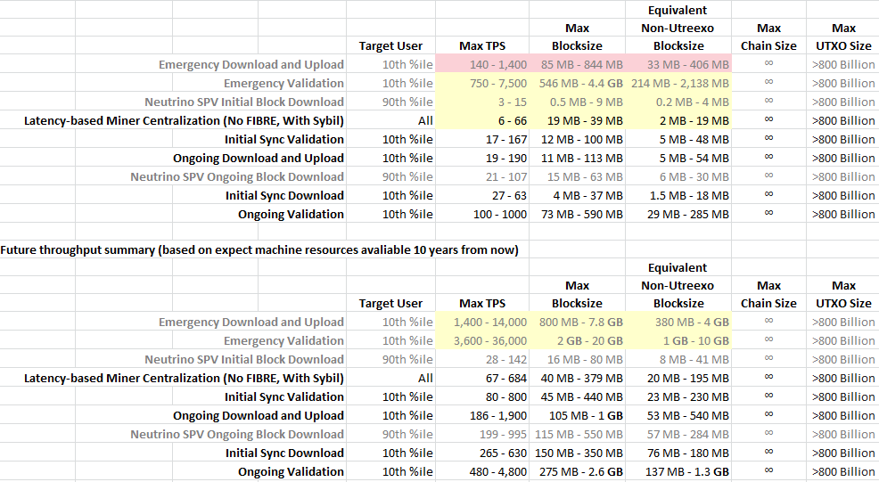

**Status: v1.1 Final**

# An Analysis of Bitcoin's Throughput Bottlenecks, Potential Solutions, and Future Prospects

Debate about growth of Bitcoin's blockchain has raged for years now. Some want to increase transaction throughput by increasing block size (scaling). Others want to focus on technologies that improve (decrease) the resources necessary to run the network as it grows (improving scalability). It hasn't helped that there are [many misunderstandings](https://medium.com/@thecryptoconomy/7-misunderstandings-of-bitcoins-scaling-problem-c5142e938a68) of where Bitcoin's bottlenecks are.

In this document, I will first analyze the major throughput bottlenecks that constrain the safe throughput capacity of current (2019) Bitcoin software. These bottlenecks are all driven by stress put on the machines that make up the Bitcoin network in worst-case adversarial situations. After looking at the bottlenecks of current software, I will talk about potential solutions to those limits and estimate the throughput capacity we might be able to expect in the future.

I will show that, because of limitations of today's SPV nodes, it isn't safe for most users to run SPV nodes. I will show why fraud proofs are critical to making Bitcoin resilient against dangers even while a large fraction of users use SPV nodes rather than full nodes. I will also show that while Bitcoin currently may not be in a safe state, future software optimizations could allow Bitcoin safely process likely more than 100 transactions/second on today's hardware.

*If you'd like me to spend more time doing things like this, here's my donation address: 3A6oFuV4AwbC2WrnqG4Mjs5aAQLBRMHqyM : )*

- [Prior Work](#prior-work)
- [Effects](#effects)
- [Failure-Mode Considerations](#failure-mode-considerations)
- [The State of Available Machine Resources](#the-state-of-available-machine-resources)
- [General Goals](#general-goals)
- [Bottlenecks of Bitcoin Software in 2019](#bottlenecks-of-bitcoin-software-in-2019)
  * [Assumptions and Requirements](#assumptions-and-requirements)
  * [SPV Nodes in 2019](#spv-nodes-in-2019)
  * [Initial Block Download](#initial-block-download)
  * [Initial Sync Validation (without assumevalid)](#initial-sync-validation-without-assumevalid)
  * [Initial Sync Validation (using assumevalid)](#initial-sync-validation-using-assumevalid)
  * [Ongoing Transaction Download & Upload](#ongoing-transaction-download--upload)
  * [Ongoing Validation](#ongoing-validation)
  * [UTXO Set Disk Usage](#utxo-set-disk-usage)
  * [Blockchain & UTXO disk usage](#blockchain--utxo-disk-usage)
  * [UTXO Set Memory Usage](#utxo-set-memory-usage)
  * [Mining Centralization Pressure](#mining-centralization-pressure)
- [Summary of the Current Bottlenecks](#summary-of-the-current-bottlenecks)
- [Potential Solutions](#potential-solutions)
  * [Assume UTXO](#assume-utxo)
  * [Assume UTXO, Ignore Historical](#assume-utxo-ignore-historical)
  * [Erlay](#erlay)
  * [Proactive Transaction Inclusion in Blocks](#proactive-transaction-inclusion-in-blocks)
  * [Increased Block Times](#increased-block-times)
  * [Fraud Proofs](#fraud-proofs)
  * [Accumulators](#accumulators)
  * [Upgraded SPV Nodes](#upgraded-spv-nodes)
  * [Distributed data storage](#distributed-data-storage)
  * [Timelocks that Pause During Congestion](#timelocks-that-pause-during-congestion)
  * [BetterHash](#betterhash)
  * [Emergency Mode](#emergency-mode)
  * [Better-Connection Seeking Protocol](#better-connection-seeking-protocol)
  * [Hole Punching Connections](#hole-punching-connections)
  * [Sharding](#sharding)
- [Future throughput and capacity needs](#future-throughput-and-capacity-needs)
  * [UTXO Expectations](#utxo-expectations)
  * [Lightning Network contingencies](#lightning-network-contingencies)
- [Bottlenecks of Future Bitcoin](#bottlenecks-of-future-bitcoin)
- [User Growth and Growth of Public Nodes](#user-growth-and-growth-of-public-nodes)
- [Conclusions](#conclusions)
- [Appendix](#appendix-a---derivation-of-initial-block-download-equations)
- [Changelog](#changelog)
- [References](#references)

# Prior Work

LukeJr analyzed sync time and gave [results of his analysis](https://www.youtube.com/watch?v=CqNEQS80-h4) that lowering the blocksize maximum to 300KB would allow us to maintain the current sync time, and would allow sync time to decrease slowly over the years. But [his script](https://github.com/fresheneesz/bitcoinThroughputAnalysis/blob/master/LukeJr's%20sync-time%20script.py) only calculates one bottleneck (sync-time, or technically just chain-size).

[BitFury's paper on Block Size Increase](https://bitfury.com/content/downloads/block-size-1.1.1.pdf) in 2015 quantified the effect of blocksize on the basis of how many nodes would be excluded from the network. It contains a lot of good info, but their estimate of how many nodes would be excluded is not well justified and doesn't attempt to estimate current or future nodes that are or will be excluded.

# Effects

Making the block size larger has a number of effects:

A. Users would need to store more data on their hard drive. This includes both nodes that store the historical blockchain as well as pruning nodes that need to store the UTXO set, since a larger blocksize is likely to mean more growth of the UTXO set (because at the moment, the average transaction creates more outputs than it consumes).

B. Users would need to use more bandwidth to download and upload more data from and to their peers.

C. Users would need to use more of their computer's CPU time and memory to verify transactions.

D. Users who can't do A, B, or C (or feel its not worth it) would not be able to run a full node, and would instead use a node with lighter requirements, like an SPV node.

E. Blocks would take longer to propagate through the network, which causes additional pressure for miners to merge or centralize.

# Failure-Mode Considerations

In order to evaluate Bitcoin's bottlenecks, we need to understand the various relevant failure modes that need to be avoided for safe operation of the Bitcoin network.

## Network Resource Exhaustion

There needs to be enough nodes serving data to serve data to nodes that need that data. If there aren't nodes with enough public connections or bandwidth, then not all users will be able to use the network.

## Node Resource Exhaustion

Each node needs to have enough computational resources to do the work necessary for it to be a part of the network. If a node has too few resources, it will be left behind. Full nodes need to do more work than light nodes, but light nodes still need to do some work.

## Sybil and Eclipse Attacks

A Sybil attack is a situation where an attacker connects many apparently unrelated nodes (that in reality they control) to the network. Sybil attacks don't cause damage directly, but rather provide the attacker with a tool they can use as part of another attack. A Sybil attack can allow the attacker to the following things:

* **Drain network resources** (connections, bandwidth, etc) by taking up connections that could be used by legitimate nodes and intentionally slowing down their link speed to the lowest point without getting disconnected from. At its worst, this can be used to deny service to other nodes, for example by monopolizing public node resources.
* **Strategically slow down block propagation** by letting half the network get blocks through quickly, but slowing down the speed of the other half of the network (by using the above technique). This could be used by a miner to unfairly mine more blocks than their share of hashpower would otherwise be able to.
* **Deanonymize nodes** by linking the node's IP address with transactions it sends out, which a sybil can do by finding the first node that sent out the transaction message. Using a timing attack, this can be done even for nodes using proxies (like Tor).
* **Extract other information from the network** in a similar fashion to deanonymizing nodes.
* **Makes it easier to eclipse individual targets**, since an attacker with a sybil network will likely already have connections to the target.

An Eclipse attack is like a Sybil attack but is targeted at one or more nodes. This is where an attacker controls all connections a node or group of nodes has to the rest of the network. This allows an attacker to:

* Censor transactions or other messages an eclipsed node tries to broadcast.
* Censor messages incoming to the eclipsed node.

These two forms of censorship can be done selectively or strategically in a number of ways so that the node may not know its being eclipsed. This can also be used to block eclipsed miners' blocks or make double-spending on the eclipsed nodes slightly easier (depending on how much of a decrease in hashpower a node will tolerate). A large-scale Sybil attack where the attacker has most of the nodes in the network is basically both a Sybil and an Eclipse attack at the same time, since a large fraction of network nodes could be eclipsed purely by chance.

One critical way to protect against Sybil and Eclipse attacks is to increase the number of connections each node makes to the network. But each connection a node has adds additional load. Another way Bitcoin software protects from these kinds of attacks is by ensuring only one outbound connection is connected to any node in a given [/16 masked subnet](https://networkengineering.stackexchange.com/questions/3697/the-slash-after-an-ip-address-cidr-notation), which makes it much harder for non-botnet entities to eclipse a node, since IP addresses are usually allocated from the same subnet block and the ability to obtain addresses from different subnets is almost never availble. Some additional measures are taken for incoming connections to public nodes, but these only take affect when the node has maxed out its incoming connections.

Because of how Bitcoin nodes store known addresses, private nodes that have connected to the network before would be less suceptible to this and it would take a long-running Sybil attack to eclipse nodes active on the network before the attack begun. How long this would take is [a question I don't know the answer to](https://bitcoin.stackexchange.com/questions/89541/how-often-does-a-node-connect-to-a-random-node). I also don't know how many new nodes enter the network (that would be potentially eclipsed).

Because of the uncertainties around this, I'll assume an attacker would employ a long-running Sybil that would avoid the above issues by diffusing into the records of nearly all nodes. I'll also assume that the maximum budget we'd see would be from a state-level attacker.

### Manipulation of Block Propagation via Sybil

In one type of attack, if the Sybil attack is designed to slow down block propagation in order to give their mining operation an advantage, the attacker would try to maximize the percentage of connections of honest public nodes that are used to connect to their attacker nodes. To do this, the attacker would need to create as many nodes as possible in order to maximize the probability that a public node making an outgoing connection will connect to it (rather than an honest node). It would also want to create as many outgoing connections to public nodes as it can. These nodes would operate to look like normal honest nodes most of the time, but when their mining operation mines a block, as soon as the block gets halfway through the network, the attacker nodes would simply stop propagating that block, delaying the time when the second half of the network can start mining on top of it.

To Sybil or Eclipse a node, it would likely be cheapest to use a botnet. These can cost as little as $7/hr for 1000 nodes[[53]](https://securelist.com/the-cost-of-launching-a-ddos-attack/77784/). As of this writing, there are about 9000 public nodes[[54]](https://coin.dance/nodes), which means that running a 90% sybil attack would cost about $410,000 per month ($5 million/year) for the 81,000 nodes necessary. In a 90% sybil attack, `.9^8 = 43%` of new private nodes would be completely eclipsed and `1-.1^8 > 99.99%` of public nodes would have at least one connection to a sybil attacker node. A state-level attacker willing to put $1 billion per year into a Sybil attack could run 16 million nodes.

Up against a state level attacker with a budget of $1 billion per year, current bitcoin simply has no chance of withstanding attacks like these. An attacker with that budget could currently mount a sustained 95.8% Sybil attack. The only two levers for making an attack like this harder that are relevant to throughput are to increase the number of public nodes or increase the number of connections. However, even if the number of public nodes were multiplied 100 times (to 900,000 public nodes), an attacker with that size of budget could still control 95% of the connections, allowing the attacker to easily drain network resources and manipulate block propagation speeds. Likewise, if outgoing connections were multiplied by 100 (to 800 connections), only 1 in 1000 nodes would have at least 4 connections to the honest network (see [the math](https://math.stackexchange.com/questions/2722410/general-function-to-find-the-probability-of-finding-an-event-with-a-given-probab)). We only really get into reasonable ranges when we get to around 900,000 nodes all with 80 outgoing connections, for which 66% of nodes would have at least 4 connections.

For future bitcoin that has certain improvements and a whole world of users, a $1 billion/year Sybil attack would only be able to run a 17% Sybil if 1% of nodes were public (80 million nodes), and a 67% Sybil if 0.1% of nodes were public (8 million nodes). However, a >95% Sybil would be required to significantly impact latency, which would cost about $8 billion/year to run at 0.1% public nodes.

If we want to ensure that a state-level attacker can't significantly manipulate block propagation, about 5 million public nodes are needed.

### DOS via Sybil

In another type of attack, if the Sybil attack is designed to slow or deny service to bitcoin users, the attacker would try to use up all the connections of honest public nodes and maximize the number of private nodes that connect to it. The attacker would then omit information it sends to those private nodes or send information late or at slow speeds. This type of attack would be gated by bandwidth rather than number of nodes, since even a few hundred nodes could likely use up the incoming connections of public nodes if they had enough bandwidth.

A Sybil attacker could rent a botnet for about 50 cents per hour per 1 Gbps or $4380 per year.[53] If every public node tolerates connections that collectively total 50 Mbps, this type of attack could eat all the connections for the current 9000 public nodes for about $160,000 per month or $2 million/year. A state level attacker with a $1 billion/year budget could eat up 5 Tbps of bandwidth (enough for 4.5 million 50 Mbps public nodes).

If we want to ensure that a state-level attacker can't DOS the network, we need to ensure that full nodes have a total bandwidth capacity of over 230 Tbps, which would amount to over 4.5 million 50-Mbps nodes.

### Sybil Summary

The conclusion from the above is that the only way to get to a level that could withstand a state-level attacker, we would need to drastically increase the number of public nodes and total bandwidth capacity of public full nodes, which probably just requires massive increases in adoption. Numbers are really what matter here, and not ratios. About 10% of nodes are public at the moment, and much less than 1% of users run full nodes at all. That last ratio is likely to decrease as less sophisticated users join the network.

More than 5 million are likely needed to prevent either one of these attacks. This makes it critical that we encourage the growth in numbers of public full nodes. This can be done by making them more accessible (or maintaining how accessible they currently are) or by attracting more people to run them.

## Chain Splits

Chain splits happen when one or more miners release blocks that fork from the main chain and are no longer built on top of blocks in the main chain. Bitcoin full nodes will follow the longest valid chain, but what if the longest chain isn't valid? Full nodes won't recognize it, however light nodes would currently follow the longest chain even if its not valid, in most cases. SPV nodes don't currently have any way to be aware of most types of consensus rules changes.

Imagine that a large fraction of Bitcoin users were using SPV nodes that couldn't tell if the longest chain contains invalid transactions or not. If the majority of miners decide to change the rules and add invalid transactions to their blocks, all of those users would start using that invalid chain. These people would not be switching rules on purpose, but would accidentally follow this new chain because they have no way of knowing that the chain is invalid. It's possible that enough people would hear about it and understand enough about the rules change to eat any loss they've taken (for the day or two they were on the wrong chain) and decide to switch back. But it seems equally likely that people would simply do nothing and stay on the new chain, either because they assume they have no control, they don't understand what's going on, they've been rushed into thinking its a good idea, or any number of other reasons.

In such a scenario, all the SPV users who were paid in that time would be receiving the new coin when they thought it was the old coin. If the new majority fork changed the rules in an unsafe way, that new coin could lose its value quickly either as a disaster happens, or as people realize that it has security problems and sells it off for the old coin. This could represent a total loss to all users who were paid in that new coin. It would also result in denial of service for any of those users that wanted to pay people who stay on the old chain (eg full nodes) - payments would be made but never received. This would have a high cost in people's time, money, and sanity.

This is why its imperative that a strong supermajority of users run clients that can automatically discover whether the longest chain is valid or not. At very least, I think everyone can agree that building SPV clients so they do the same behavior as a full nodes in such a situation wouldn't be a bad thing. Luckily, it looks like the fraud proofs or fraud hints needed to do this aren't difficult to add and might not even require a consensus change (see the "Potential Solutions" section).

## Mining Centralization

Bitcoin mining is a process that's sensitive to block propagation delays. The longer it takes for blocks to reach other miners, the more "head start" the miner who just mined the block (and miners who are closely connected to that miner) gets. Larger miners that mine blocks more often get that head start more often, which gives those larger miners a disproportionate advantage in comparison to their share of the total hashpower. This disproportionate advantage is a pressure to centralize mining and consolidate it into a single closely-connected entity.

If Bitcoin mining were consolidated into an entity that had a single set of controllers, it would put Bitcoin at risk because it would be a single point of failure, and could lead to a 51% attack. So its critical that the Bitcoin network operate in a way that limits propagation delays below levels that would give a significant advantage to larger miners.

# The State of Available Machine Resources

To understand what the Bitcoin network can do, we need to understand what resources the machines in the Bitcoin network have or will have. I'll discuss the current state of machine resources and how those resources are growing (or costs are shrinking) over time.

I'll then choose ranges of values for current bitcoin users. The 90th percentile and 10th percentile users will be used as representative lower bounds. The width of the ranges will represent the uncertainty in those values, since I don't have exact numbers. The wider the ranges, the less certainty there is. But the true value hopefully will be within that range with a reasonably high confidence.

I'll also choose ranges of values for future bitcoin users, though I will choose numbers that represent what resources those future users **currently** have, meaning that if we were to expand Bitcoin to all the world's people, what machine resources does any person that can use Bitcoin have. Since you need to have access to a computer to use Bitcoin, I won't consider people who don't have computers, but I will consider potentially old computers that people are still using. For future bitcoin users, we'll choose different numbers for the 90th percentile and 10th percentile users, and we'll also choose numbers for the 1st percentile user since that becomes relevant when advances to SPV nodes make it safe for the vast majority of users to run SPV clients instead of full nodes.

## Bandwidth

The world's average internet speeds range between 380 Kbps and 85 Mbps, however among large countries the lower range is more like an average of 2.5-7.5 Mbps (China) and among richer countries the lower range of this is an average of 9.2-17.3 Mbps (Italy) (the ranges are there because of data from different sources)[[5]](https://en.wikipedia.org/wiki/List_of_countries_by_Internet_connection_speeds)[[6]](https://www.atlasandboots.com/remote-jobs/countries-with-the-fastest-internet-in-the-world/). The top 10% of countries have lower-end average speeds of 15-30 Mbps (again, depending on the source). The bottom 10% of countries have upper-end average speeds of 1-2 Mbps. And surprisingly, the data seems to show that mobile connection speeds aren't terribly different from landline speeds, so I'll ignore the difference for this paper.

The general consensus is that most Bitcoin users are more tech savvy and more affluent people, so for current Bitcoin users, I'll assume that 90% of users have bandwidth of more than 9-17 Mbps and that the top 10% of users have above-average internet in the range of at least 50-150 Mbps.

In the future, we want Bitcoin to be able to reach the poorest of people. So for the section analyzing future Bitcoin, I'll assume that 90% of people have below-average (current) bandwidth of more than 0.5-1 Mbps, the top 10% have speeds of 15-30 Mbps, and the top 1% have business-class fiber speeds of at least 1000 Mbps.

The worlds internet speeds are increasing around 25%/year (23% in 2015[[7]](https://www.akamai.com/us/en/multimedia/documents/content/state-of-the-internet/q4-2015-state-of-the-internet-connectivity-report-us.pdf), 26% in 2016[[8]](https://www.akamai.com/us/en/multimedia/documents/state-of-the-internet/q4-2016-state-of-the-internet-connectivity-report.pdf), 30% in 2017[[9]](https://www.speedtest.net/insights/blog/global-speed-2017/), see also [some charts of growth](https://royal.pingdom.com/asia-extremes-internet-speeds/)). Note that in developing countries, these speeds are likely increasing faster than in developed countries, but also that the rate of increase is going down.

### Data Caps

Many ISPs place caps on the amount of data their customers can download/upload in a month. Once the data cap is reached, bandwidth is throttled down or extra fees are charged. There are about 3.5 billion internet users worldwide[[57]](https://en.wikipedia.org/wiki/Global_Internet_usage) and about 2 billion of them only access their internet via their phone.[[60]](https://www.cnbc.com/2019/01/24/smartphones-72percent-of-people-will-use-only-mobile-for-internet-by-2025.html) I'll assume the other 1.5 billion have some kind of broadband internet. About 1 billion of those people have caps on how much data they can download in a month[[58]](https://broadbandnow.com/internet-providers-with-data-caps). I assume the other 2.5 billion people don't have data caps. According to that data, the 90th percentile data cap for broadband internet users is around 10GB and only 27% of internet users have data caps.

I wasn't able to find as great of data for mobile, but it looks like mobile data caps are generally in the range of 1.5 - 20 GB unless you live in an outlier country like Copenhagen, Dublin, or Seoul.[[59]](https://www.newamerica.org/oti/policy-papers/the-cost-of-connectivity-2014/)[[61]](https://www.datareign.com/airtel-unlimited-data-fup-prepaid-mobile-plans.html) I don't have good data on the distribution of those caps are tho.

To put these numbers into perspective, a 1.5 terabyte data cap can only support an average of 4.5 Mbps (`(1500/30/24/60/60)*1000*8`).

For current Bitcoin users, I'll assume they all have desktop machines or laptops with broadband connections with 10 - 1000 GB caps for the 90th percentile user and 1000 GB - Unlimited for the 10th percentile user.

For future Bitcoin, many more people will be mobile users, so I'll use 2 - 10 GB for our 90th percentile user, 1000 GB - Unlimited for the 10th percentile user, and Unlimited data for the top 1%.

Since I don't have any data on growth of data caps, I'll assume caps grow as fast as bandwidth (which may not be an accurate assumption).

## Latency

Latency is another factor that's relevant for time-sensitive data transmission, like propagating newly mined blocks.

It takes light about 65ms to go halfway around the earth, and in fiber optic cable it takes about 100ms[[10]](https://hpbn.co/primer-on-latency-and-bandwidth/). So one could expect any hop (to another bitcoin node) to have an average of at about 50ms of latency per hop. In reality the latency is 1.5 to 6 times as long because of other delays. For example, last-mile latency is a significant factor adding around 15ms for fiber connections, 25ms for cable connections, and 45ms for DSL[[11]](https://potsandpansbyccg.com/tag/last-mile-latency/)[[13]](https://www.igvita.com/2012/07/19/latency-the-new-web-performance-bottleneck/). It gets even worse for mobile phones, but we'll ignore that for our analysis.

All in all, we can expect perhaps around 90ms of latency per hop in the bitcoin network for nodes using fiber, 130ms for nodes using cable, and 250ms for nodes using something else (like DSL).

For this paper, I'll assume that both the current 90th percentile user and the 10th percentile user are both using cable of current users are using cable with a latency-per-hop of 130ms.

For the analysis of future Bitcoin, I'll assume that the (current) 90th percentile user has something with DSL-level 250ms latency (most users will likely be using mobile devices that have more latency than land lines), the top 10% of users have cable latency of 130ms, and the top 1% have fiber latency of 90ms.

While we should see last-mile latency improve as more machines move to fiber (and from DSL to cable), it's unlikely we'll see much improvement in latency beyond that, since fiber is about as fast as it gets for light directed through a wire. If we treat 15ms as a near-minimum last-mile latency and assume that most of the reduction in latency in the US between 2010 and 2012 happened at the last mile, then that was actually about a 20% reduction in last-mile headroom latency. This translates to an 11%/year improvement towards our assumed minimum. Outside of the US, there was no improvement in latency at all in those years. So for the purposes of this analysis, I'll use a 4%/year rate of improvement (asymptotically decreasing towards the speed-of-light minimum).

## Hard drive space

I had a hard time finding data for disk space in the world, but I took a look at the [cheapest smartphones you can get in india](https://www.scoopwhoop.com/9-best-budget-smartphones-you-can-get-in-india-in-january-2019/) for an idea. The [Xiaomi Redmi Y2 specs](https://pricebaba.com/mobile/xiaomi-redmi-y2) can be bought for about 8,600 rupees ($120) and has 32GB of storage. This seems like a reasonable amount of storage to expect someone would have even in a poor country, given that you can get a 32GB SD card for $7 these days. The [cheapest laptop](https://www.newegg.com/deep-gray-dell-latitude-e6330-mainstream/p/1TS-000A-04E41) I could find on NewEgg, by contrast, has 250GB, and the [most expensive](https://www.newegg.com/black-lenovo-p71-thinkpad-workstation/p/1TS-000E-0BWM1) has 3 TB.

But since most Bitcoin users are more affluent, for analysis of current Bitcoin I'll use a range of 250-500 GB for the 90th percentile users, and 500-2000 GB for the top 10%. Note that I'm using wide ranges because I'm less certain about these numbers.

For analysis of future Bitcoin, for the (current) 90th percentile users I'll use 32-128 GB, 128-1000 GB for the 10th percentile users, and 1000-4000 GB for the top 1%.

The cost of hard disk space is declining at a rate of about 25%[[15]](https://www.backblaze.com/blog/hard-drive-cost-per-gigabyte/), tho that rate is slowing.

## CPU speed

I was not able to get good information about CPU speed because it's difficult to know how many transactions a machine with some given specs could validate. I would [be curious](https://bitcoin.stackexchange.com/questions/87864/how-can-i-calculate-estimate-how-quickly-a-machine-can-verify-transactions-on-th) to know more. However, [Eric Kuhn mentioned](https://twitter.com/erickuhn19/status/1095553655086804993) that verifying the transactions can be a much larger bottleneck than downloading them. There are about [415 million transactions](https://www.blockchain.com/charts/n-transactions-total) in the bitcoin blockchain, and if it can take 25 days to verify everything, as Eric Kuhn mentioned, that means his raspberry pi could only verify about 192 tps. Also James Lopp [said a Casa node synced from the genesis node in 311 minutes](https://blog.keys.casa/bitcoin-full-validation-sync-performance/) in October 2018, which clocks in at about 18,500 tps. So there seems to be a pretty wide spread here.

For current Bitcoin, I'll assume the 90th percentile user can verify 200-2000 tps, the top 10% can verify 2000-20,000 tps. Again, the very wide ranges represent how uncertain I am about these numbers.

For future Bitcoin, I'll assume that the 90th percentile user can (currently) verify 100-1000 tps, the top 10% can verify 1000-10,000 tps, and the top 1% can verify 20,000-100,000 tps.

The cost of cpu power is decreasing at less than 20%/year [[19]](https://www.imf.org/~/media/Files/Conferences/2017-stats-forum/session-6-kenneth-flamm.ashx), so I'll use LukeJr's number of 17%/year for cost of CPU power.

## Memory

As for memory, the Xiaomi Redmi Y2 (which I also used for its disk space specs) has 3 GB of RAM[[14]](https://pricebaba.com/mobile/xiaomi-redmi-y2). This actually seems like a lot, and the $120 price point is probably not something that's affordable to the world's poorest 50%, given that price is about half of the median monthly income of $240. Our [cheapest newegg laptop](https://www.newegg.com/deep-gray-dell-latitude-e6330-mainstream/p/1TS-000A-04E41) has 4 GB of RAM and our [most expensive newegg laptop](https://www.newegg.com/black-lenovo-p71-thinkpad-workstation/p/1TS-000E-0BWM1) has 64 GB.

For current Bitcoin, I'll use 2-4 GB for the 90th percentile user and 4-16 GB for the top 10%.

For future Bitcoin, for the (current) 90th percentile user I'll use 1-4 GB, for the top 10% I'll use 4-8 GB, and for the top 1% I'll use 8-32 GB.

Memory has been decreasing in cost by [about 15%/year](https://jcmit.net/memoryprice.htm) (See also [my calculations](memoryCostOverTime.xlsx) on that data).

## An aside about technological growth

The calculations done in this paper assume a constant exponential growth of machine resources for a given cost over time. However, in reality, the rate of growth has been shrinking, so the estimates here will be less accurate and overestimate limits more the further out in time they are extrapolated. Also note that generally the areas of the world with the least machine resources currently are growing the fastest because they're taking advantage of technology that has already been developed in other areas of the world. These two forces may cancel each other out somewhat.

# General Goals

In order to evaluate how many transactions the Bitcoin network can process, we need to decide what we want the Bitcoin network to be and what we want the network to do. Once we choose goals, we can evaluate the limitations of the technology we're considering and then calculate the transaction throughput at which those goals are barely met for each major process necessary for users on the Bitcoin network to do.

We don't need the people with the worst equipment to mine (#5), and we might not even need them to support the network (#1) very much, but we do want them to be able to be able to know about and have confidence about their own transactions (#2), and we want them to be able to know what chain they're on (#3) and to be able to withstand attempted eclipse attacks (#4) even from state-level attackers (#6).

The following are the general goals I came up with that I'll use throughout the paper, for both the section on current throughput and the section on future throughput:

## 1. Transaction and Block Relay

We want enough people to support the network by passing around transactions and blocks that all users can use Bitcoin either via full nodes or light clients. Relay is important, but we don't need everyone to do it - just a critical mass. As long as even a small percentage of the network is honest and passes around data, the network can be supported during normal operation. The smaller this percentage, however, the more load that the nodes that do pass around this data must take on. The most important nodes are public nodes, since without them no one can connect to the network.

## 2. Discovery of Relevant Transactions and their Validity

We want all users to be able to discover when a transaction involving them has been confirmed, and we want all users to be able to be able to know with a high degree of certainty that these transactions are valid. Higher-value transactions should have near absolute certainty.

This one is most affected by blocksize changes. SPV nodes are very tempting as they come up almost instantly, don't require any major harddrive space or processor usage, and also give security guarantees somewhat close to full nodes. So the more painful it is to be a full node, the more people are going to use an SPV node instead. This doesn't need to be a problem in the future, but currently there are a number of problems with SPV nodes that I'll touch on in another section below.

## 3. Resilience to Sybil and Eclipse Attacks

We want to be resilient in the face of attempted sybil or attempted eclipse attacks. The network should continue satisfying these goals even when sybil attacks with a cost accessible to a state-level attacker are ongoing and nodes should be able to resist some kinds of eclipse attacks.

This is relevant because one primary tradeoff for this is that increasing the number of outgoing connections each node makes reduces their susceptibility, but this also increases network load for each node, especially if many nodes are leeching data but not seeding. Again, public nodes are particularly important here, since if public nodes are overloaded, the network can't operate even with plenty of extra non-public full nodes.

## 4. Resilience to Chain Splits

We want to be resilient in the face of chain splits. For example, if a majority wants to change bitcoin in a way that a minority thinks is dangerous or compromises the system, its important that minority can maintain the operation of their chain in the face of a majority split. It should be possible for every user to continue using the rules as they were before the split until they manually opt into new rules.

In the case of a hard fork, SPV nodes won't know what's going on. They'll blindly follow whatever chain their SPV server is following. If enough SPV nodes take payments in the new currency rather than the old currency, they're more likely to acquiesce to the new chain even if they'd rather keep the old rules.

## 5. Mining Fairness

We want many independent people/organizations to mine bitcoin. As part of this, we want mining to be fair enough (ie we want mining reward to scale nearly linearly with hashpower) that there is no economically significant pressure to centralize and so that more people/organizations can independently mine profitably. There will always be a limited number of large mining operations and pools, simply because of the nature of marketing and virality, but as long as the pressure doesn't strongly drive the number of operations to reduce below 4 or 5 independent operations/pools, Bitcoin should remain as safe from a 51% attack as its going to get.

Mining is important to bitcoin, but we don't need everyone to do it. Like relaying transactions (#1) we only need a critical mass to do this. Also mining has a different profile than the rest of the considerations, since miners are generally either large powerful server farms or large mining pools, and thus generally have access to much better machine resources. Miners are unlikely to drop out of bitcoin even if there were many orders of magnitude more transactions (as long as fees held up). However, there is the issue of block propagation time, which creates pressure for miners to centralize. If significantly higher ROI can be gained by joining a large pool or investing in a larger miner, then mining operations will inevitably merge and centralize over time, giving enormous power to the controllers of large mining operations. Propagation time has only been partially mitigated with advancements like [compact blocks](https://bitcoincore.org/en/2016/06/07/compact-blocks-faq/).

## 6. Resilience Against Attacks by State-level Attackers

Bitcoin is built to be able to withstand attacks from large companies and governments with enormous available funds. For example, China has the [richest government](https://www.pouted.com/top-10-richest-governments-world/) in the world with [$2.5 trillion](http://www.chinatax.gov.cn/eng/n2367736/index.html) in tax revenue every year and another $2.4 trillion in reserve. It would be very possible for the Chinese government to spent 1/1000th of their yearly budget on an attack focused on destroying bitcoin. That would be $2.5 billion/year. It would also not be surprising to see them squeeze more money out of their people if they felt threatened. Or join forces with other big countries.

So while it might be acceptable for an attacker with a budget of $2.5 billion to be able to disrupt Bitcoin for periods of time on the order of hours, it should not be possible for such an attacker to disrupt Bitcoin for periods of time on the order of days.

## Non-goal 1: Privacy

While we certainly want to consider privacy in the ongoing design of Bitcoin, Bitcoin is not built to be a coin with maximal privacy - there are other cryptocurrencies that do much better on that front. Because of that, for the purposes of this paper, I will not consider privacy concerns to be relevant to Bitcoin's throughput bottlenecks.

## Non-goal 2: Eclipse and Overwhelming Hashpower

While we want nodes to be able to resist eclipse attacks and discover when a chain is invalid, we expect nodes to be able to connect to the honest network through at least one honest peer, and we expect a 51% attack to remain out of reach. So this paper won't consider it a goal to ensure any particular guarantees if a node is both eclipsed and presented with an attacker chain that has a similar amount of proof of work to what the main chain would be expected to have. This has implications for SPV nodes especially, to which slightly more damage can be done in such a case.

# Bottlenecks of Bitcoin Software in 2019

In order to come up with hard numbers for throughput limits, I've made some assumptions about the state of people's machine resources above, and below I will determine some hypothetical support requirements.

This will allow us to estimate Bitcoin's current bottlenecks, which are all calculated in [a spreadsheet](https://github.com/fresheneesz/bitcoinThroughputAnalysis/blob/master/bottlenecks.xlsx?raw=true). I'll summarize the findings of those calculations below.

## Assumptions and Requirements

Bitcoin.org documents the [minimum requirements](https://bitcoin.org/en/full-node#minimum-requirements) for running a full node, however with the current state of technology, we must substantially lower these requirements so as to make running a full node as accessible as possible to even people in poorer countries, because of the (fixable) issues with SPV nodes at the moment, primarily the fact that SPV nodes can't follow full-node consensus in the case of a majority hard fork. The only way a user can currently follow consensus in such a case today is by running a full node. So for the analysis of **current** Bitcoin as the software is today, we must have the requirement that the vast majority of users run a full node, even though this shouldn't be necessary in the future.

Not everyone can afford a dedicated node that uses 100% of its bandwidth/cpu/memory on bitcoin. We can reasonably expect that maybe 10% of a machine's resources go to bitcoin on an ongoing basis. During initial sync tho, we can reasonably require a bit more of a machine's processing power, since that's a temporary setup period.

I will use the following hypothetical support requirements:

**I.** 90% of Bitcoin users should be able to start a new node and fully sync with the chain (using assumevalid) within 1 week using at most 75% of the resources (bandwidth, disk space, memory, CPU time, and power) of a machine they already own.

**II.** 90% of Bitcoin users should be able to validate block and transaction data that is forwarded to them using at most 10% of the resources of a machine they already own.

**III.** 90% of Bitcoin users should be able to validate and forward data through the network using at most 10% of the resources of a machine they already own.

**IV.** The top 10% of Bitcoin users should be able to store and seed the network with the entire blockchain using at most 10% of the resources (bandwidth, disk space, memory, CPU time, and power) of a machine they already own.

**V.** An attacker with 50% of the public addresses in the network can have no more than 1 chance in 10,000 of eclipsing a victim that chooses random outgoing addresses.

**VI.** The maximum advantage an entity with 25% of the hashpower could have (over a miner with near-zero hashpower) is the ability to mine 0.1% more blocks than their ratio of hashpower, even for 10th percentile nodes, and even under a 50% sybiled network.

For the purposes of this analysis, I'm going to use the following estimates:

* The 90th percentile of Bitcoin users have 0.2-2 Mbps bandwidth, 8 connections, 32-256 GB of disk space, 1-2 GB of memory, enough cpu power to verify 100-500 transactions per second, and enough power that it isn't an issue (tho this assumption should probably be reconsidered).
* The 10th percentile of Bitcoin users have 20-50 Mbps bandwidth, 88 connections, 500-2000 GB of disk space, 4-8 GB of memory, enough cpu power to verify 5,000 transactions per second, and enough power that it isn't an issue.

*See the "Ongoing Transaction Download & Upload" section for how 88 connections was calculated for the 10th percentile user.*

These goals split our users into 3 types. The "10th percentile users" represent 10% of the users with the most machine resources. The "90th percentile users" represent 80% of the users (from the 10th percentile to the 90th). The bottom 10% that don't fall within these goals can be assumed to use SPV. An SPV node can give its user almost as much security as a full node (except in important exceptional cases), even tho it doesn't help the rest of the network.

## SPV Nodes in 2019

One obvious question is: why do we need or want most people to run full nodes? One can imagine that since SPV nodes are so cheap to run, maybe it would be acceptable if most people simply used SPV. However there are a number of problems with this at the moment:

* **SPV nodes can be [lied to by omission](https://bitcoin.stackexchange.com/questions/36643/thin-client-remote-node-lying-through-omission)**.
* **SPV nodes have a low number of connections**. Most SPV clients only make four connections to SPV servers.
* **SPV nodes have [privacy problems](https://eprint.iacr.org/2014/763.pdf)** related to Bloom filters.
* **Light clients don't support the network.** They don't validate transactions (other than SPV proofs they're passed) or entire blocks so they also don't pass around transactions, tho they can pass around block headers. However, they do consume resources. This is ok as long as we have a critical mass that do support the network (which is why I chose 10% as the fraction of nodes that do that). But if too big a fraction of the network consists of SPV nodes, then we won't reach that critical mass of full nodes that can adequately support the network.
* Light clients are fundamentally **more vulnerable in a successful [eclipse attack](https://medium.com/chainrift-research/bitcoins-attack-vectors-sybil-eclipse-attacks-d1b6679963e5)** because they don't validate most of the transactions. Full nodes and light clients can both have nefarious things done to them if they are eclipse attacked. A full node that has been eclipsed can have its outgoing or incoming transactions censored and can be tricked into following a chain with less work than the main chain (by cutting them off from that main chain), which can make it easier to double-spend on them more easily than in a non-eclipse situation (tho perhaps only 2 or 3 times more easily at most). A light client (even using Neutrino) that has been eclipsed has those problems as well, but can also be tricked into accepting many kinds of invalid blocks (with about the same level of difficulty as double-spending on an eclipsed full-node). A 2015 paper showed that a botnet of just over 4000 nodes could eclipse a victim with a high propbability, tho some of their countermeasures have been deployed in Bitcoin already.[[51]](https://eprint.iacr.org/2015/263.pdf) I should reiterate here that protecting a light client against an attacker that both has majority hashpower and can eclipse the client, is out of scope for this paper.
* **SPV nodes don't know that the chain they're on only contains valid transactions.** They can validate SPV proofs sent to them about transactions they query SPV servers for, and they validate the headers of the longest chain, but if the longest chain contains invalid transactions, an SPV node won't know that. In the case that a majority decide to change the rules of bitcoin in a dangerous way, SPV nodes will blindly follow the new rules as long as they can still validate their SPV proofs. So for a healthy level of decentralization and user-level agency in consensus rules, not too much of the network should consist of nodes that are suceptible to that kind of majority consensus rules change.

The last one is most important. If the vast majority of the network is unable to protect against an invalid longer-chain, then everyone in the network is suceptible to an unwanted and unintentional change of consensus rules, which could potentially leech the majority of wealth onto a less secure branch. I talk about this in a bit more detail in the section above about "Chain Splits". This is why its imperative that a strong supermajority of users run clients that can automatically discover whether the longest chain is valid or not.

SPV nodes are not the solution to scaling at the moment, tho they can help scale if these problems are solved.

## Initial Block Download

The equation for the maximum size of the blockchain that can be downloaded by our 90th percentile users is (See [Appendix A](#appendix-a---derivation-of-initial-block-download-equations) for derivation):

`maxSize = 94 KB/s * 1.25^years * 1 week = 94*1.25^y*(7*24*60*60)/10^6 GB`

The maximum throughput our 90th percentile users can manage at that maximum size at a given year `y` is:

`maxSize' = 94 KB/s * ln(1.25) * 1.25^years * 1 week = 94*1.25^y*(7*24*60*60)/(365*24*60*60) KB/s`

This means the current maximum chain-size we can safely support is 57 GB, and the maximum growth at that size requires a maximum blocksize of 241 KB. If we keep Bitcoin unchanged, we won't reach safe operation for over 10-15 years, as far as IBD is concerned for the stated goals.

## Initial Sync Validation (without assumevalid)

First, I'll do this without the benefit of assumevalid, since some people believe the only way to be sure you're on the right chain is to download and validate the entire thing. The equations (See [Appendix B](#appendix-b---derivation-of-the-equation-for-initial-sync-validation-without-assumevalid) for derivation) for how many transactions we can process to meet a given sync-time requirement are:

`maxTransactions = 200 * 1.17^y * (7*24*60*60)`

`maxTransactions' = 200 * ln(1.17) * 1.17^y * (7*24*60*60)`

The current maximum number of transactions we meet our goals with is 0.5 transactions/second, which is equivalent to a maximum block size of 129 KB. This would take over 15 years to get to a point where we're meeting goals.

## Initial Sync Validation (using assumevalid)

With [assumevalid](https://bitcoinmagazine.com/articles/bitcoin-core-0140-released-whats-new/), not all transactions in the chain need to be validated. I'll assume a hypothetical 6-month software release cycle, where the assumevalid block is chosen 1 month before release, which means a new client with correct software will only need to validate blocks up to 7 months into the past. I'll assume that avoiding transaction signature validation saves 90% of the transaction processing time (some processing is still needed to build the UTXO set). Note that in practice, assumevalid currently gives in total (including processing of transactions past the assumevalid point) approximately a [50% transaction-validation time reduction](https://www.reddit.com/r/Bitcoin/comments/5xomir/0140_is_a_beast_48_faster_initial_sync/) (ie a 100% speedup).

Because the equations for blockchain size using assumevalid aren't solvable for the number of transactions over time (see [Appendix C](#appendix-c---derivation-of-the-equation-for-initial-sync-validation-using-assumevalid)), I decided to solve approximately with guess and check in excel. Basically I have a starting point for the blockchain size and transaction throughput, from which I calculate the number of recent transactions not assumed valid and the number of old transactions that are assumed valid. I also calculated a number that I called the "Adjusted Equivalent Transactions", which is the number of transactions that a node could process without the benefit of assumevalid in the same amount of time that a node could process the full (non adjusted) transactions. From that adjusted value, I calculated the syncTime. Each subsequent blockchain size is calculated from the transaction throughput the previous year, and I played around with each year's throughput so that the syncTime was about 7 days for each year.

Since there's multiple solutions to this, I calculated one set of solutions anchoring on the current blockchain size and a second set of solutions anchoring on the current throughput. They ended up having somewhat similar numbers. Using the current blockchain size of 415 million transactions as the anchor point, for the low-end of machine resources the maximum throughput would be 4.1 tps or the equivalent of about 1.2 MB blocks, and for the high-end of machine resources the maximum throughput would be 60 tps or the equivalent of 17 MB blocks. Using the current throughput of about [4.2 transactions/second](https://www.blockchain.com/en/charts/transactions-per-second?timespan=all&daysAverageString=7) (which translates to blocks of about 1.2 MB) as the anchor point, for the low-end of machine resources the maximum blockchain size would be about 390 million transactions (about 85% of the current blockchain size), and for the high end the maximum blockchain size would be about 11 million transactions (about 20 times the current blockchain size). This means that even when using assumevalid to avoid validating old transactions, its unclear whether or not Bitcoin is meeting the goals for initial-sync validation.

## Ongoing Transaction Download & Upload

Our 90th percentile users need to download and upload blocks, including their transaction information, on an ongoing basis. Currently, nodes transmit every validated transaction to their connections as [inv messages](https://en.bitcoin.it/wiki/Protocol_documentation#inv) (transaction inventory messages), which encode transaction identification info in about 36 bytes each. This method of communication means that every connection you relay to increases your bandwidth usage.

Currently by default, the core Bitcoin client makes 8 outgoing connections to peers, and nodes with a publicly accessible port accept up to 125 incoming connections. The number of connections that each public node needs to make available can be given by:

`publicNodePercent*publicNodeConnections > outgoingConnections`

If only 10 percent of users are required to open up public ports, that means each public node needs at least `8/.1 = 80 public ports` which is `80 + 8 = 88 connections`.

Each node will need to send inv messages for each transaction they haven't received from any given peer. On average, we could expect that a random transaction will have been received by half of that node's connections by the time they validate it. By the same token, each node will have to send inv messages for each transaction they haven't received from each seeder peer to that other peer. So in total, the node will have to either send or receive one inv message per transaction from each of its connections. In addition, the node will have to download the actual transactions from just one of its connections. Likewise, it's likely to need to upload each transaction to only one of its peers.

So the amount of transaction data any node can expect to handle can be given by:

`totalData = transactions*(invSize*connections + 2*transactionSize)`

Therefore the maximum number of transactions/second can be given by:

`maxTps = bandwidth/(invSize*connections + 2*transactionSize)`

The maximum transactions per second that meet the goals for our 90th percentile users is 10 tps, which is an equivalent blocksize of 3 MB, so Bitcoin does currently meet goals for ongoing data transfer.

Because our 10th percentile need to have an average of 80 incoming connections each, they have many more connections they need to serve than our 90th percentile users. However they also have much more machine resources so they end up being better off than the 90th percentile users, and are also well within limits at a max of 152 tps or an equivalent of 43 MB blocks.

## Ongoing Validation

`maxTps = tpps * speedGrowth^t`

Our 90th percentile users need to validate transasctions on an ongoing basis. The maximum transactions/second we can mine while meeting our goals on this dimension is 20 tps, or the equivalent of about a 5.7 MB block. So we're well within limits here too.

## UTXO Set Disk Usage

Since for the purposes of this analysis, our 90th percentile users don't need to upload historical blocks to newly syncing peers, they can simply use the pruning option to discard old blocks as soon as they're validated, and the only major data needed would be the UTXO set. As of 2017, the UTXO set required [about 3GB](https://eprint.iacr.org/2017/1095.pdf), well within the capabilities of our 90th percentile user. Since the number of transaction mined per second is not directly related to UTXO growth, there's no clear way to relate these. However, the UTXO set size grew at a rate of [about 75%/year](https://charts.bitcoin.com/bch/chart/utxo-set-size#74) between 2015 and 2017, and that has been somewhat representative, despite the drop in UTXO size in the last year. The trend does look like its slowing, so it is probably prudent to assume a near-term growth of at least 50%/year. At that rate its size would pass the target 12.8GB of disk space (10% of the amount our 90th percentile user has) within 4 years. So this is definitely something to watch out for becoming a problem in the near future.

However, another thing to note is that the UTXO set can't grow in megabytes faster than the blockchain grows. So the maximum block size is a limiting factor on the maximum growth of the UTXO set, although that is unlikely to affect growth of the UTXO set for probably 10 years.

## Blockchain & UTXO disk usage

Since our 10th percentile users do currently need to store the whole blockchain, they'll need to store not only the UTXO set but the blockchain as well.

Currently, the maximum blockchain size that can fit in 10% of our 10th percentile user's 1 TB of disk space is 97 GB (plus 3 GB of UTXO), and the maximum throughput would be 1.6 tps with 450 KB blocks. So we are currently not meeting the goals here.

## UTXO Set Memory Usage

According to [out of date information](http://gavinandresen.ninja/utxo-uhoh), the UTXO set is about 6.4 times the size of the form as it exists on disk. At the same time, the entire UTXO set doesn't need to be stored in memory, but the less a node keeps in memory, the slower it'll validate transaction on average. The current default for --dbcache is 450 MB[[33]](https://github.com/bitcoin/bitcoin/blob/452bb90c718da18a79bfad50ff9b7d1c8f1b4aa3/doc/release-notes/release-notes-0.14.1.md). For this analysis, I've assumed that keeping 2.3% (450 MB / 3 GB) of the UTXO set in memory is a near-optimal tradeoff (ie doesn't lose you significant validation speed).

With these assumptions, the UTXO size is already too high to meet goals for our 90th percentile user by a factor of 3, and we can only expect this to get worse over time.

## Mining Centralization Pressure

As of this writing, miners use the Bitcoin FIBRE network (aka Matt Corallo's relay network), which closely connects them together to reduce latency. However, the Fibre relay cannot determine if data is valid because of the way the Forward Error Correction works[[34]](https://github.com/libbitcoin/libbitcoin-system/wiki/Relay-Fallacy). This opens up an opportunity for attackers to spam the relay network. The Faclon network, developed by Cornell researchers, is another proposal to speed up relay, but it presumably also has the same problem since data is relayed without being validated by most nodes. Also, both FIBRE and Falcon are protocols that are permissioned by a centralized system[[35]](https://bitcoinmagazine.com/articles/how-falcon-fibre-and-the-fast-relay-network-speed-up-bitcoin-block-propagation-part-1469808784) and so rely on trusting the controlling entities (like Matt Corallo or Cornell) not to play favorites or be compromised by another entity (like a government). For example, the Fast Relay Network is run by Matt Corallo and requires nodes to register with Matt Corallo's system in order to connect.

If the fast relay networks are disrupted, miners may have to fall back to using basic block relay to obtain the most recently mined block. Each full node that relays a block would have to receive and validate each transaction in the block before passing each on, which significantly adds to the latency between block broadcast and receipt of all of a block's data by the rest of the miners.

More latency means more centralization pressure because this latency represents the "head start" that the miner who mined the latest block gets in mining the next block. Miners that mine blocks more often (larger miners) would get this "head start" more often, which translates into an advantage out of proportion with their share of hashpower.

In 2014, ghash.io obtained greater than 50% of the bitcoin hashpower[[36]](https://www.extremetech.com/extreme/184427-one-bitcoin-group-now-controls-51-of-total-mining-power-threatening-entire-currencys-safety). This was widely supposed to be caused by increased orphan rates for smaller mining pools. While its not 100% clear that centralization pressure caused this scenario, its certainly possible. In 2015, it took an average of 11 seconds to reach half the nodes in the network[[37]](https://tradeblock.com/blog/bitcoin-network-capacity-analysis-part-6-data-propagation) and in 2013 the average was about 12.6 seconds[[38]](http://www.gsd.inesc-id.pt/~ler/docencia/rcs1314/papers/P2P2013_041.pdf). This is quite a lot of delay, however it represents delay to all nodes in the network rather than delay to all mining nodes in the network. The delay to nodes that actually were trying to mine was strictly less than that. How much less isn't something I have data for.

The maximum block size that can support a given centralization pressure goal (`apparentExtraHashpowerPercent`) for a given amount of hashpower (`percentHashpower`), can be expressed as (see Appendix E):

`maxBlocksize = ((apparentExtraHashpowerPercent*blocktime/percentHashpower)/hops - 3*latencyPerHop)/((2*(compactness + missingTransactionPercent))/avgBandwidth + validationTime*missingTransactionPercent/transactionSize)`

The Erlay paper[39] has a latency chart showing experimentally determined average transction propagation time to X% of the Bitcoin network:

The propagation of "BTCFlood" for transactions should be very similar to the latency of block propagation, since the time to download, verify, and upload are insignificant next to the latency. According to the graph, the average latency to any particular node in the network can be calculated by measuring the area under the curve (estimating with right triangles):

`(1*.9+0.25*.7/2+0.25*0.2+(3.125-1.25)*0.2/2)/.9 = 1.36 seconds`

This matches up pretty closely to the latency I estimated on the spreadsheet (1.48s). This latency alone gives a miner with 25% of the hashpower a 0.05% mining advantage, which is half the stated goal even without considering verification time or data transfer time.

To gain some additional intuition about how latency, CPU power, and bandwidth affect miner centralization, I created a couple tables showing how much each component adds to the average block-propagation time for various values.

As you can see, latency is likely the largest component. Latency also makes up a significant fraction of the delay. It is also the most difficult component to improve, since latency of physical links is limited by the speed of light. Transaction validation can be a significant source of delay, but probably not quite as significant as latency at current blocksizes. Bandwidth affects delay the least. However, as blocksize increases, transfer time and validation time increase while latency doesn't. So these factors do still affect centralization pressure in a significant way.

I estimated the maximum block size both in a situation without a sybil attack and with a sybil attack. If a sybil attack is in effect, sybil attackers could theoretically keep a low enough profile to not get banned but still slow down block propagation. They would do this by contributing at-average or slightly below-average amounts to the network, and by taking up valuable connections. If a sybil attacker has 50% of the public nodes, this would effectively reduce the usable connections by half.

Because Bitcoin doesn't need the majority of users to mine, the nodes that mine can be machines with higher required resources. And because of the nature of a well-connected network that data will propagate through the fastest links first, slower nodes in the network won't significantly affect how quickly miners receive block data. This actually makes mining centralization pressure currently one of the least constraining factors.

For the given goal of 0.1% centralization pressure for a miner with 25% of the hashpower, the upper-bound on average propagation time is 2.4 seconds. With my estimations for these values, we are currently well within goals even in a sybil environment. The maximum blocksize that meets the goal is 20 MB.

Keep in mind, the estimates given about centralization pressure are by far the ones I'm least sure about in this write up, since centralization pressure is highly dependent on a ton of factors including connectivity of the network, geographic distribution of machines with various properties (processor power, bandwidth, latency, etc), network infrastructure, miner connectivity, and more. The FIBRE network is currently critical for keeping centralization pressure to a minimum, and we should attempt to maintain networks like that if at all possible.

While this may not be a problem now, latency cannot be eliminated entirely and a small amount of centralization pressure will always exist for any proof of work system. Since latency improves very slowly and block propagation is primarily gated on latency, infrastructure improvements for latency will not keep up with other factors (like CPU and memory cost). This means that centralization pressure will likely become more of an issue over time, relatively speaking in comparison to other bottlenecks.

# Summary of the Current Bottlenecks

Here's a summary of the above analysis of the various bottlenecks Bitcoin currently has. This list is in order of tightest to widest bottleneck in Bitcoin throughput.

Ignoring the first item, there is 1 bottleneck that is almost certainly causing Bitcoin to be unable to support our 90th percentile users, 1 bottleneck doing the same to our 10th percentile users, and 3 bottlenecks that may or may not meet goals for our 90th percentile users. This leads me to conclude that Bitcoin is currently not in a secure state. We're currently operating at between 2 and 10 times the throughput that can be safely handled. The most constraining bottlenecks are currently disk usage and memory usage for the 10th percentile users.

If we want a healthy network, we need to solve those bottlenecks in some way, or reduce the block size. However, the UTXO size may not be significantly affected even by reducing the block size, so that's a problem that requires a technical solution (like Utreexo).

# Potential Solutions

There are a number of proposed solutions to the above Bitcoin bottlenecks. Some solutions given here exist somewhere as full proposals, and a couple are only hypothetical half-baked ideas. But this list should be able to give some idea of the future prospects of Bitcoin throughput. I did a deep dive on Assume UTXO, but decided only to mention other proposals and then do a deeper analysis of where Bitcoin could get to if all the solutions are implemented and work out as planned.

## Assume UTXO

Assumeutxo is a [proposed upgrade](https://github.com/bitcoin/bitcoin/issues/15605) to Bitcoin where the software source code would include an "assumed good" hash of the UTXO set at a given blockheight, similar to what assumevalid does. The node will download the UTXO set (or chunks of it) from some other node (or nodes) on the network, and verify that the UTXO set matches the hash hardcoded into the software. Once the software has validated forward from the assumevalid point, it will download the historical chain and validate the UTXO set by building from the genesis block. However, while its downloading and validating the historical data, it will use its assumed good UTXO set.

This feature would allow us to relax some of our goals. Instead of requiring 90% of users to be able to download the blockchain and build the UTXO set in 1 week, we can have different goals for downloading and processing the blocks from the assumevalid point versus downloading historical blocks and verifying the assumeutxo hash. The assumeutxo hash is something that would be audited as part of the rest of the software review process, and so using it requires no more trust than any other part of the software. Because of that, the historical validation process is less critical and can be allowed to take longer without much downside. I'm going to choose 2 months for that historical validation, which would mean that in the unlikely case that the UTXO hash is invalid, the 90th percentile user would find out about it at latest 2 months after beginning, tho it would probably be far more likely for them to find out through social channels rather than through the software at that point.

Updated Assumptions and Requirements:

I. 90% of Bitcoin users should be able to start a new node and sync with the chain from the assumevalid point within 1 week using at most 75% of the resources of a machine they already own, and be able to download the historical chain before the assumevalid point and validate the UTXO set, using at most 10% of the resources of a machine they already own.

The maximum size of the after-assumevalid blockchain that can be downloaded by our 90th percentile users at year `y` can be found using the following parameters (see [Appendix D](#appendix-d---derivation-of-equations-for-assumeutxo) for derivation):

`maxDownload = 94*1.25^y*(7*24*60*60)/10^6 GB`

The maximum throughput that makes the after-assumevalid download stay within limits for our 90th percentile users can manage at that maximum size is:

`maxChainSize' ~= (downloadSize - utxoSize)/(7*24*60*60 seconds)`

The maximum size of the historical blockchain that our 90th percentile users can download at year `y` is:

`maxDownload = 12.5*1.25^y*(60*24*60*60)/10^6 GB`

The maximum throughput our 90th percentile users can manage for the historical download at that maximum size at a given year `y` is:

`size' = 12.5*ln(1.25)*1.25^y*(60*24*60*60)/1000^2 GB/year`

Here is how that updates our bottlenecks:

With Assume UTXO, we can eliminate two of the worst bottlenecks, while adding 4 new bottlenecks that aren't quite as bad, but still don't all meet goals. The initial blockchain download and UTXO set download creates a bottleneck of a max blocksize between 150 KB and 25 MB, which indicates that its possible our current blocksize would still be much too large to be safe still below our current maximum block size. Two other bottleneck are questionable as well, tho less so.

Note that these updates wouldn't change the fact that blockchain and UTXO storage are still the most constraining bottleneck.

## Assume UTXO, Ignore Historical

The current plan for Assume UTXO is to maintain historical download and verification, even if it becomes less important. However, there is little reason why all nodes should have to do this.

Let's talk software-security fundamentals. To use Bitcoin in a maximally secure way, a person needs to read through the entirety of the source code for every release, have or gain an understanding of every concept used in the system, compare it to the relevant discussion online and claims made by the developers, and finally compile it themselves. If the software is not the reference client (Bitcoin core), then you would also need to compare the software to that reference client (since there is no formal spec). Even if you do all of this, you still must trust that whoever you got the software from and the online discussions from gave you the bitcoin everyone else is using. Trust can't be eliminated entirely, only minimized.

If you don't do all the above things, then you are additionally trusting other people to audit the software and alert the community (in a way that you would hear about) if something is wrong with the software. Similarly, if you don't download and verify the entire chain, and instead trust the assumevalid utxo height and assumeutxo hash, that requires the exact same additional level of trust - no more no less than trusting other people to audit.

For any Bitcoin user that is ok with this near-minimal level of trust, downloading and validating the parts of the blockchain before the assumevalid/assumeutxo marker is unnecessary as no additional trust is given. The vast majority of users don't even have the skills to audit the entirety of the source code, and so ignoring the historical parts of the blockchain is just as secure.

There is an important addition to Assume UTXO that needs to be in place before historical data can be ignored in the worst-case. If a longer but invalid chain is created from before the assumevalid block height, a node would need to validate the longest chain from the branch point (the block both chains share) to the first invalid block. This could be arbitrarily long. In order to prevent newly syncing users from being required to do this, honest nodes would have to be able to produce [fraud proofs](#fraud-proofs) so the newly syncing node can quickly and cheaply identify and ignore the invalid chain.

If this was done, the worst-case sync time would scale linearly with the transaction throughput rather than scaling linear with blockchain length. The enormity of that improvement can't be overstated. This would eliminate the most constraining bottleneck (Blockchain & UTXO disk usage).

## Erlay

[Erlay](https://lists.linuxfoundation.org/pipermail/bitcoin-dev/2019-May/016994.html) improves transaction propagation to scale nearly linearly with number of transactions, rather than scaling linearly with transactions X connections. This would make it possible for nodes to have many more connections than they do now, which would make nodes a lot more resilient to eclipse and sybil attacks. Remember that a node only needs one connection to an honest node on the network to be safe from eclipse.

In order to remain resistant to eclipse and sybil attacks, every node must have enough connections to the network to ensure a high probability of connecting to the honest network. A reasonable lower bound on the probability of being eclipsed by an attacker depends on the percentage of the network controlled by the attacker and the number of outgoing connections a node makes.

The relationship between number of `outgoingConnections`, the `ratio` of attacker's nodes to total nodes, and the `chanceOfEclipse` is as follows:

`ratio^outgoingConnections = chanceOfEclipse`

`outgoingConnections = log(chanceOfEclipse)/log(ratio)`

Let's say our goal was to require an attacker to have only 1 chance in 10,000 to eclipse a target if they controlled half the addresses in the system. This means that to achieve our goal stated above (where `changeOfEclipse = 1/10,000` and `ratio = 0.5`, every node would need at least 14 outgoing connections to the network. 20 outgoing connections would give 1 chance in 1 million for such an attacker. If we wanted to instead be resilient to an attacker with 90% of the public nodes, each node would need almost 90 connections. Erlay could make these scenarios possible.

## Proactive Transaction Inclusion in Blocks

In my analysis of mining centralization pressure above, latency is multiplied by 5 because of back-and-forth messages that happen on broadcast of a block. However, if a node keeps track of which transactions its connections are known to already have, any transactions in a block that a connection is not known to have can be sent proactively with the block info so that no additional back-and-forth is needed. This may transmit some extra transaction data, but it could reduce latency by a factor of 5 because 4 out of 5 messages can be eliminated (the block inv, block request, transaction request, and transaction response).

## Increased Block Times

If we need to reduce miner centralization pressure, one easy way to do that is to increase block times (and increase block sizes proportionally, to keep existing throughput). Increasing the block time would reduce the impact of latency, which means that centralization pressure would reduce even though we wouldn't reduce throughput. For example, raising the target block time to 20 minutes would cut the centralization pressure due to latency delay in half. This could even be used to build a proof-of-work system that can credibly work on an interplanetary scale. Block times would have to be much longer for that, however. Perhaps greater than 10 hours.

## Fraud Proofs

[Fraud proofs](https://scalingbitcoin.org/transcript/tokyo2018/fraud-proofs) are data structures that can prove that a block is invalid. This can be used for:

* Alerting SPV nodes that they should ignore a longer chain (a chain with more proof of work) because it's invalid.
* Making it cheaper for full nodes to find what part of a chain is invalid.

Fraud proofs are a critical piece for some of the other solutions listed here. Fraud proofs require data availability and so must be accompanied by a way to prove data-availability.[[52]](https://arxiv.org/pdf/1809.09044.pdf) [This](https://gist.github.com/justusranvier/451616fa4697b5f25f60) is one proposal for fraud proofs.

## Accumulators

[Accumulators](https://www.reddit.com/r/BitcoinDiscussion/comments/bz883v/a_short_summary_of_solutions_for_utxo_scaling/) show a lot of promise in nearly eliminating the storage overhead associated with the UTXO set. For example, [Utreexo](https://dci.mit.edu/utreexo) allows nodes to store a representation of the entire UTXO set in only a few kilobytes of data. This does come with higher bandwidth requirements, perhaps doubling or tripling the necessary bandwidth. However, necessary bandwidth would only grow logarithmically with the size of the UTXO set, which is a big improvement from the linear growth the UTXO set has for memory right now.

Additionally, a lot of bandwidth could be saved by using a little bit of memory. Many levels of Utreexo's Merkle forest could be stored in memory to reduce the amount of Merkle proof data necessary to include alongside transactions (in turn reducing bandwidth requirements). Using just 100 MB of memory for this purpose would cut the necessary extra bandwidth almost in half.

In order to make a transaction with Utreexo, the sender needs to have access to proof their transaction is included in the UTXO set for a recent block. Because the accumulator changes with every block, the proof of inclusion for every UTXO must also change in each block. This requires that owners of UTXOs either continuously update their proofs (which requires downloading every transaction and processing it through the Utreexo merkle forest) or that the owners of UTXOs get another node to do that for them. So there must be enough network resources to serve light nodes with their UTXO proofs at least when they use those proofs to make a transaction, but more likely periodically, for example once per day. That period would need to be short enough where the light client could calculate their own proofs in a reasonable time span in the case that their full node stopped serving them proofs. That is explored in the section on *Bottlenecks of Future Bitcoin*. 

Other solutions like RSA or Eliptic Curve based accumulators could eliminate growth of bandwidth in relation to UTXO set size entirely. RSA accumulators have inclusion proofs of constant size no matter how big the UTXO set is. They can also do proof of non-inclusion (aka proof of completeness) which could allow SPV nodes to eliminate the possibility of being lied to by omission. Eliptic curve accumulators could have the similar properties but with a much smaller footprint. And symmetric accumulators remove the need for witness entirely. These are active areas of research.

## Upgraded SPV Nodes

SPV nodes have a bunch of problems at the moment. But luckily, most of those can be addressed clever technology.

[Neutrino](https://blog.lightning.engineering/posts/2018/10/17/neutrino.html) is one of those technologies. It isn't a scaling solution per se, but it does help SPV solve the privacy problem. The Bloom filters currently used for SPV have privacy problems, because SPV clients send requests to SPV servers that give away what specific transactions they're interested in. Neutrino are much more private while maintaining a low overhead for light clients - each filter needed for the protocol is only about 15 KB per 2 MB block. An SPV client would determine which blocks have transactions they care about, and request entire blocks. By requesting different blocks from different SPV servers, an SPV client can have a reasonable likelihood of maintaining privacy. In a near-sybil or near-eclipse attack, however, there's still possibility for deanonymization via correlation of requested blocks. But the risk is much lower than with the bloom filters that are used today.

And Neutrino solves the problem of being lied to by omission. To allow light clients to trustlessly download the block filters, those filters need to be committed into the block by miners. That way an SPV node can check that block filters they're given match the commitment in the block. Since the filters are committed to in the block, SPV nodes know for sure which blocks they want, and they can know they're being eclipsed if all their connections refuse to give them the blocks they need to verify their transactions.

One issue with Neutrino, however, is that it does mean that SPV nodes using it have to download data whose size scales with the number of transactions. This means that there are still some limits to how large blocks could get before low-resource SPV nodes using Neturino could no longer keep up. At that point, the SPV client would have to fall back to using something less resource intensive, like bloom filters.

Most SPV clients currently only connect to four SPV servers, which is small enough that a determined attacker could have a reasonably high chance of successfully eclipsing the client. SPV clients should increase their number of connections substantially (I recommend 14 connections).

Fraud proofs can help SPV nodes protect themselves from majority hard forks. If some of their connections are sending them blocks on a chain with less proof of work, they can ask those nodes to prove that the longer chain is invalid. Those nodes could prove it using fraud proofs, thus allowing the SPV nodes to successfully (and cheaply) avoid a majority hard fork.

The above solves almost all the problems with SPV nodes, bringing their security up to almost full parity with full-nodes. However, the fundamental downside still remains - there are more attacks that can be done on an SPV node that has been eclipsed than a full node that has been eclipsed. While it takes the same amount of effort to attack an upgraded SPV node as it does to attack a full node, an attacker can do slightly more damage to an SPV client once the necessary work has been done to achieve that attack.

If that limitation is acceptable to most people, then most people can safely use SPV nodes as long as a critical mass of users are still running full nodes.

## Distributed data storage

Bitcoin as it is now isn't actually distributed. Replicated would be a better term, because every node replicates the transaction verification and storage that every other node does (ignoring pruning).

This doesn't need to be the bottleneck it might appear. What is important for full nodes is that they've verified past history, and that they can download the past history when they need it. It should be relatively simple to spread out blockchain storage in the distributed network. If every full node on the network stored 1/1000th of the blockchain, then a 5.5 TB blockchain would just require 5.5 GB per full node - very manageable even on the oldest of machines these days.

Even light clients could choose to take part in replication of a shard or two. Any node, full or light, could choose to store a shard of the blockchain history, then serve Neutrino requests for that data. Similar sharding could be done with UTXO accumulators or other storage requirements. Nodes could also store shards of UTXO set at an assumevalid point and serve requests from newly spinning up full nodes. A light node would verify that they have the right UTXO shard by checking it against a UTXO commitment in the blockchain.

With enough sharding, blockchain storage would cease to be a scalability concern. The question would be how to ensure that each shard has enough replication. Additionally, the finer the sharding, the greater the danger of DOS attacks that target a particular shard. Both of these problems would have to be solved for distributed data storage to become a reality.

Distributed data storage could have other applications in the Bitcoin world as well. For example, backup of lightning commitments comes to mind.

## BetterHash

This is a bit tangential to goal 5, mining fairness, but the [BetterHash](https://bitcoinmagazine.com/articles/betterhash-protocol-lets-pool-miners-regain-control-over-their-hash-power) mining pool protocol could go a long way towards removing the possibility of mining pool operators from doing anything nefarious like a 51% attack. This protocol makes it so individual miners are in control over the construction of blocks, rather than the mining pool operator. Block latency could still create mining centralization pressure, but at least the control over block creation would be far more decentralized.

## Emergency Mode

In a situation where many lightning channels must close (for whatever reason), it may be acceptable to process, for a short while, more transactions per second than it is normally safe to process. In such a case, full nodes and miners could go into an "emergency mode" where a higher than normal number of transactions per second can be mined (similarly to [Monero's dynamic block size](https://github.com/JollyMort/monero-research/blob/master/Monero%20Dynamic%20Block%20Size%20and%20Dynamic%20Minimum%20Fee/Monero%20Dynamic%20Block%20Size%20and%20Dynamic%20Minimum%20Fee%20-%20DRAFT.md)) and full nodes could be alerted that there is temporarily high stress on the network. This would help clear transactions from the mempool so that it would be far less likely that any lightning channels would close with out-of-date commitment contracts.

Since an event like this is unlikely to happen frequently, it might be acceptable to use more resources to protect the system in a situation where that's needed. The downside is that for the period of higher stress, fewer full nodes could spin up or keep up with transactions, and therefore more nodes would have to rely on SPV-level security. More nodes relying on SPV would also potentially put a more stress on full nodes. Also, a dynamic block size has the potential to be influenced by unintended factors.

This is most definitely one of the least-baked ideas in this write up, but it could potentially allow second-layer protocols to retain almost as much security as the base layer (on-chain Bitcoin). Since second-layer solutions are critical to scaling Bitcoin, ensuring that layer one supports operating those second layers securely is also critical to scaling Bitcoin.

## Timelocks that Pause During Congestion

Lightning network channels rely on being able to get transactions on-chain when its necessary to enforce contracts against an uncooperative channel partner. In a situation where many lightning channels must close, its possible that the number of transactions increase and fees increase suddenly such that its difficult to get those lightning-enforcing transactions confirmed. To avoid a situation like this, the lightning network whitepaper suggests creating time-locked transactions that pause their time-lock counting during network congestion. So, for example, if a channel partner submits an out-of-date commitment transaction during a period of transaction congestion, the timelock won't start counting down until congestion has passed.

This would require some way to determine how congested the network is. One method would be to simply look for the rate at which the median fee increases, and define congestion on that basis. So certain congestion levels might slow down the clock, and there might also be a maximum threshold that stops the clock until the congestion has passed below that level. Another method would be to have miners commit a value to each block that says whether there's congestion (say in the mempool).

## Better-Connection Seeking Protocol

Currently, only public nodes who have all their connections filled up are choosy about which connections they take, which means that most nodes are susceptible to Sybil attackers that don't contribute much to the network. A Sybil attacker node can pretend to be a low-resource node that receives information late and verifies it slowly.

To protect against this, all nodes could be programmed to continuously seek out the best connections they can find (up to the quality that node can support), measured by its ability to deliver new transaction data earlier than other connections and with higher bandwidth. This would make it much harder for an Sybil attacker to drain network resources or delay information propagation.

## Hole Punching Connections

Only about 10% of Bitcoin nodes have public ports open to connect to. If Bitcoin included an automatic way for any two nodes without publicly open ports to connect to each other without user intervention, we could increase the number of public nodes nearly tenfold. This could be done using a technique called [hole punching](https://en.wikipedia.org/wiki/Hole_punching_(networking)), where each node connects to a 3rd node that's public and then the private nodes use the "hole" punched by the connections to the public node's connection to connect to each other. Hole punching is a reasonably reliable technique, with perhaps around 90% of NAT routers supporting hole punching.[[55]](https://www.zerotier.com/the-state-of-nat-traversal/)[[56]](https://bford.info/pub/net/p2pnat/)

Bitcoin currently supports using UPnP (Universal Plug and Play) as a NAT traversal technique but it has been disabled by default since 2015 when a [vulnerability was found](https://bitcoin.org/en/alert/2015-10-12-upnp-vulnerability) in the library used for UPnP. The vulnerability has been patched, but UPnP remains off by default for some reason.

## Sharding

Blockchain sharding could make contributing to the network easier for nodes with less machine resources. Instead of validing all transactions, a node could choose a fraction of the transactions to validate.

How this would work is:

1. The blockchain would be split up into multiple shards. In this example, we'll use 10 shards. There would be some way to determine what transactions belong in which shard. For example, shards could be split by address mod 10, where the address in question would be the the originating address for the first input.
2. A lottery would then be run to determine who wins the opportunity to mine the next block. This could be done by using proof of work, for example hashing a combination of the hash of any of the 2 most recent blocks on any chain, plus a random number.
3. If the resulting hash is both low enough to satisfy the difficulty, it grants the hasher the right to mine a block. Which shard they mine on could be determined by that resulting hash mod 10.
4. Then the miner would construct a block for that shard, and include the proof that they earned the right to mine that block.

This is rather different from current Bitcoin mining, primarily because the transactions in the block aren't secured by the proof of work that mines them. In other words, the miner could create any number of valid blocks using the same winning hash. Because of this, there would have to be some disincentive to create sister blocks. Perhaps any subsequent miner that can prove that multiple blocks were created using the same proof at the same blockheight can steal some or all of the mining rewards.

In any case, now that there's a random way to decide what shard a miner builds on top of, it means that there's no statistically likely way for an attacker to run a mining attack on just a single shard, because miners wouldn't be able to choose the shard they mine on.

Any full node would simply choose 1 or more shards to validate, and would essentially be an SPV node with respect to any other shard. This means that they would need to request SPV proofs for outputs that originate from other shards. In order to make each shard manageable, it should be possible to determine that an input for a transaction is spendable (unused) by the owning address using only information in the shard for that address. This would also mean that transactions with inputs or outputs owned by addresses that span multiple shards would need to record information in multiple shards. The protocol necessary to do this would probably be relatively complex. A major problem is how to determine that a new output can be created in shard B when the input comes from shard A. You could require that a record in shard A that an input will be spent for a particular transaction before that transaction is recorded in shard B, however what if multiple duplicate transactions are attempted to be mined in shard B? It would not be scalable to require validators of shard B to keep a queriable databases of all inputs ever used in their shard. One could have such a record kept temporarily, which would then add the requirement that the shard B transaction must be mined within a certain time period of when the shard A record was mined. This would further complicate things. This cross-chain communication is one of the major problems with sharding.

But let's say that problem gets solved. If the average transaction has 2 inputs and 2 outputs, a node that fully validates 1 out of 10 shards would need to handle 10% of the transactions mapped to their shard, plus 90% of the time it would need to request SPV proofs for the one input from an external shard, plus for the 90% of transactions that don't map to that shard, there's a 10% chance that each output needs to have a record also included in their shard, each of which has a 90% chance of requiring an SPV proof to validate it.  This means `dataDownload = 0.1*(transactionSize + 0.9*spvProofSize) + 0.9*(2*.1*(referenceSize + .9*spvProofSize))`. Transactions are about 400 bytes, SPV proofs are about 700 bytes, and a reference size could be as small as maybe 15 bytes. This means that for every system-wide transaction, a node on a single shard would average a data load of 224 bytes rather than 400 bytes. A modest decline. However, for 100 shards, a node on a single shard would average a data load of only 25 bytes per system-wide transaction. So while sharding increases the amount of data necessary to communicate through the system by about a multiple of 5 or 6, the amount of data a single node needs to verify to contribute to the network can be much smaller.

This could make it possible for nodes with fewer machine resources to contribute to the network. If instead sharding was used not as a way to increase the number of nodes that could contribute to validation, but rather to increase the transaction throughput, one risk is that each shard could have fewer nodes serving data, which could make it easier to run a sybil attack on a single shard.

While its likely this could make it slightly safer to increase transaction throughput by a small amount (maybe 10-20%), its not as clear that it could make it safe to substantially scale transaction throughput (say by a factor of 10 or 100 like is sometimes claimed). In my analysis of future throughput, I will not include sharding.

# Future throughput and capacity needs

In the future once the above solutions have been implemented, the primary purposes of limiting the block size will only be:

1. To encourage more people to run full nodes.
2. To limit mining centralization pressure.
3. To allow low-resource machines to run neutrino SPV clients.

## UTXO Expectations

If each of the 8 billion people in the world has an average of 100 UTXOs, that's 800 billion UTXOs. The size of the UTXO set would likely have substantially slowed its growth rate by this point, so it might be relatively stable. In any case, using Utreexo, this would mean proofs would be 1.3 KB (32 bytes * 40 levels). However if 540 MB of memory were used to cache the 24th level of the Utreexo merkle forest, the size of proofs would go down to 512 bytes, approximately doubling the amount of data necessary to transmit for a transaction.

## Lightning Network contingencies

The lightning network is expected to help Bitcoin scale by an enormous amount. Still, it has limits.

Since lightning network security requires on-chain transactions to enforce lightning commitments, its important that the network be able to handle the situation where a flood of channels are closed at once. Why would we see mass channel closure? If the mempool becomes congested and there's a sudden rise in unconfirmed transactions that drives fees up, people could get understandably nervous about the security of their lightning channels and some may close them early fearing that the fees will continue to increase. Doing that would of course push fees higher and could cause a cascading channel closure effect with more and more users closing channels.

A worst-case cousin of this would be if a significant number of channel partners tried to cheat by submitting an out-of-date transaction. If this happened to enough people, this would accelerate the cascading channel closures. Such a situation would basically resemble a bank run, with users trying to close their channel before their channel partner does something nefarious. The absolute worst case scenario is that every channel has one partner that tries to cheat.

A scenario where all channels have a cheater and need to close seems pretty unlikely. But a normal cascading channel closure situation doesn't seem quite as unlikely. If it's widely known that the Bitcoin network doesn't have the capcity to get all LN breach remedy transactions into the blockchain before commitment locktimes unlock, the fear of the cascading closure effect itself could be a self-fulfilling prophesy.

Eltoo might make this situation worse, since it removes most of the disincentive for cheating. Imagine a channel with 100 bitcoins in it. If channel partner X started with 50 bitcoins on their side, and then transferred 40 of them away, user X could steal those 40 back by publishing their prior commitment at an opportune time, however they would only really stand to lose two transaction fees. If the chance of success was higher than 1 in 100,000 it would be worth it to try. It seems prudent to make the punishment for cheating proportional to the funds available to steal if possible.

The only way to ensure cascading channel closure doesn't happen is for the Bitcoin network to have the capacity to clear all transactions necessary to close every channel before their commitments' lock times are up. If it doesn't have this capacity in normal operation, either timelock pauses can give channels extra time to settle, or a higher "emergency mode" blocksize can temporarily be allowed. Potentially both could work together.

Let's say that 8 billion people have an average of 3 channels each with 1 month lock times, and they all need to close. The network would have to support 4630 transactions/second for a whole month. If 10% of channels want to close in that time, this would still be 460 transactions/second for a month in order to ensure all channels can be closed without any cheaters coming out ahead.

# Bottlenecks of Future Bitcoin

Using the techniques in the [Potential Solutions](#potential-solutions) section, we could theoretically eliminate disk storage and memory as bottlenecks, and substantially reduce the number of nodes that would need to use significant bandwidth and CPU power to download and verify transactions.

The minimum requirements of a blockchain network is that some percentage of the network must validate all transactions that come through. This means they would need to at minimum:
* download all blocks, their transactions, and merkle proofs of UTXO inclusion
* upload blocks and their transactions to their connections
* upload neutrino block filters to SPV clients
* confirm that every transaction is valid
* store a number of levels of the UTXO set's merkle tree in memory.

Nodes would fall into two tiers:

1. Full nodes that validate and forward all blockchain headers and all unconfirmed transactions. These are the ones meeting the above requirements.

2. Light nodes that validate all blockchain headers, but not all the transactions.

Assume UTXO would be used in combination with fraud proofs to eliminate the need for downloading or validating historical parts of the blockchain. Erlay would be used to reduce bandwidth consumption to be almost independent from the number of connections.

Utreexo (or a more advanced accumulator) would be used to store, in-memory, the entire set of information needed to validate transactions as long as those transactions come with inclusion proofs. Light nodes would need to be associated with at least one full node (but probably two nodes) that can supply them with proofs. Full nodes would generally need to supply proofs at a regular frequency so that if the full node stops serving the light node, the light node can find a replacement. In the case the light node loses access to their proofs entirely, they would need to ask either an archival node to retrieve up to date proofs or a non-archival node willing to reprocess recent blocks for which the light node's most recent proofs are valid. For the 90th percentile users, it would generally be infeasible for them to calculate their own proofs because new blocks would be added to the chain faster than those users could process them. A reasonable frequency a light node should require proofs from the full nodes supplying it might be 12-24 hours. If each light node had 2 full nodes supplying it with proofs for 100 UTXOs every 12 hours, this would only be an average of 25 bytes/second of extra data transfer for each full node, which is negligible. 

In a situation where a longer but invalid chain is created, light nodes would be alerted by their full-node connections with fraud proofs. Either timelock-pausing or an emergency mode could protect second layers of the network from system-wide DOS attacks (or unintentional effective DOS).

SPV nodes that use neutrino still have an initial sync burden that scales linear with number of transactions per second, and so its possible that SPV initial sync becomes a bottleneck at some point in the future. It should be noted that even if 99% of the network consisted of SPV clients, the remaining 1% of full nodes should easily be able to serve data to those clients, since each SPV client needs so little data (each neutrino block is less than 1% the size of a full block). However, with the assumed data caps on the 90th percentile users, even neutrino might not be usable by those users, which would mean they'd have to fall back to using bloom filters. This might be acceptable.

Even tho scaling up 1000x from the current estimated 7 million active bitcoin users[[47]](https://www.bitcoinmarketjournal.com/how-many-people-use-bitcoin/) to a world of 8 billion people adds a ton of people to the network, it doesn't actually add much to the number of average hops necessary to propagate blocks to the network. And with additional connections that Erlay makes possible, only about 1 additional hop would be needed an average. If nodes are keeping track of which transactions their connections have via Erlay reconciliation once per second, then 4 out of 5 message trips can be eliminated by transferring the block and all transactions for that block that the connection isn't known to already have all at once. This would eliminate an enormous amount of latency-related delay. However, the additional data that would need to be sent around for Utreexo transactions cancels out most of those gains.

Here's a summary of how all these advancements would changes our limits:

Its notable that latency-based miner centralization is one of the most constraining bottlenecks, however it would only have a significant effect if the authorized FIBRE network was rendered unusable (by some attack) *and* an enormous Sybil attack was in place in the network.

Even with all these improvements, we would be unlikely to be able to safely increase the blocksize today by more than 2-5 times its size. Tho in a future with more machine resources to go around, its likely that we'll be able to see throughput of more than 70 tps.

# User Growth and Growth of Public Nodes

One of the primary reasons to limit the block size is to increase the number of full nodes run by ensuring enough users can easily run one. However, it's possible that exceeding the blocksize parameters (and thus excluding extra users from running a full node) could actually help achieve this goal by increasing the total number of people who might be able and willing to run a full node (even as the fraction of users is reduced).

The theory is that a higher adoption rate leads to more full nodes being run, and having fewer periods of high-fee network congestion will lead to faster growth in Bitcoin adoption. While increasing the resources needed to run a full node would exclude a constant fraction of users, a higher adoption rate would be compounding and so might be worth investing in for a temporary time window.

A number of things can lead to lower fees - higher segwit adoption, increased use of batching, schnorr signatures, other on-chain optimizations, increase in usage of the lightning network or other layer 2 systems, increased block size, etc. A number of the on-chain optimizations can help, but the primary solution being looked at for this is the lightning network. However, its unclear what percentage of current transactions can be replaced by use of the lightning network. Especially in periods of high demand for transactions, its highly likely that many of those transactions are performed by new entrants to Bitcoin who are buying some coin and transferring them to their wallet. The lightning network can't significantly reduce on-chain transactions for this use case, and so while the lightning network can be an enormous scalability upgrade for Bitcoin, it doesn't remove the current need of on-chain space to support adoption by new users. Its possible that the majority of transactions during high-use periods are done by frequent transactors, but its also possible the majority of transactions are done by infrequent transactors where the lightning network is far less effective at reducing the number of on-chain transactions. There's a possibility that increasing the block size may be the only way to substantially reduce fees during periods where a much-higher-than-usual new users are getting into bitcoin.

There's a couple ways that fees could reduce the growth of bitcoin usage:

1. It could cause current users to stop using bitcoin or sell their bitcoin.
2. It could cause prospective users who would have gotten into bitcoin to decide not to.

As a concrete example, we can look at the 2018 fee spike. Median transaction fees rose to a high of over $30 in january 2018 and fees remained above $5 for almost a week. Thereafter, active use of Bitcoin dropped rapidly from 1 million daily-active-addresses in January to 500,000 in March. It might be impossible to know how much of this represented people who gave up on Bitcoin and left the community (for now at least), but its almost certain that at least some fraction of people did leave because of that period of high fees. Its just as certain that fewer people adopted bitcoin because of that period. It seems very likely that more people would be using Bitcoin today had fees been lower during that period.

The question would be, how many full nodes would we lose or prevent from happening if we increased the blocksize? I don't know the answer to that question, and unless we know the answer, we can't know if increasing the blocksize "early" would help or hurt the number of full nodes. If doubling the blocksize cuts the number of full nodes in half in the long run (or medium run), then it basically breaks even, because double the blocksize basically means double the users could be supported, presumably about doubling the number of full nodes (cancelling out the full nodes being cut in half by the increased resourced needed to support the higher blocksize). If doubling the blocksize cuts the number of full nodes by more than half, then its hurting.

More research would be needed to justify that logic and figure out how blocksize would affect the number of people willing to run a public full node.

# Conclusions

At the moment, we are likely into the danger zone of transaction throughput. Using the very rough, hypothetical goals I used to do this analysis, Bitcoin cannot securely handle the amount of transactions it is currently processing. Even when assuming the most favorable numbers for machine resources, there are still two categories where goals are not reached - disk and memory use.

This is a problem not only for users who don't have access to machines that can run a full node, but for the Bitcoin network as a whole. If not enough people can run full nodes, it puts even those who can run full nodes at risk. If 95% of users are using SPV and a malicious chain happens, it means the 5% who are running full nodes suddenly can't pay or be paid by 95% of the world. That's a problem for everyone, not just the SPV nodes that have been tricked.

This can be backed up by looking at current usage estimates. It looks like there are around 100,000 full nodes running out there[46]. However, since there are around 7 million active bitcoin users[[47]](https://www.bitcoinmarketjournal.com/how-many-people-use-bitcoin/), the vast majority of active users are not running full nodes - only about 1%. Now a large fraction of those people probably also unsafely store their coins on exchanges. While that can't really be considered the fault of Bitcoin software or the Bitcoin network, the likelihood is that if most of those people got off exchanges they would move to a light wallet of some kind. It's simply not safe for 99% of the network to run a wallet that can't determine whether the chain with the most work is a valid Bitcoin chain, much less wallets that have [all the problems of current SPV clients](#spv-nodes).

I should stress that the goals used for this analysis are not well-researched enough to be taken for granted, and those goals should be reevaluated. I made it easy to change the goals in the [bottlenecks.xlsx](https://github.com/fresheneesz/bitcoinThroughputAnalysis/blob/master/bottlenecks.xlsx?raw=true) spreadsheet, so its easy to see the analysis for various any goals one might want to choose.

Also, these calculations are estimates of the limits to Bitcoin throughput. Best engineering practices include setting tolerances well within limits, not barely at limits. This is done because of uncertainties in the safety of estimated numbers and the models used to calculate them. Its basically the professional manifestation of the adage "better safe than sorry".

The good news is that ideas that have already been thought through can substantially scale Bitcoin to bring us back into a secure state. This will likely take many years to reach, but its very heartening that we have so much headroom to improve Bitcoin into a much stronger system. Based on these estimates, it wouldn't surprise me if we could engineer Bitcoin to be able to safely execute over 100 transactions per second in 10 years.

Data caps may significantly constrain the ongoing bandwidth that users can make available for Bitcoin use. If data caps increase much faster than expected, this could mean that many more people could use Neutrino SPV clients (rather than bloom filter SPV clients), and could potentially increase the safe throughput for full nodes a bit too. However, bandwidth may not actually be the most constraining factor in the future.

We should remember that people like Luke Jr are right to worry about our Bitcoin's current state and the implications of the current blocksize and larger blocksizes. It is unsafe to raise the maximum block size at the moment until new scaling technologies are incorporated into Bitcoin. In fact, it was unsafe to have increased the maximum blocksize during segwit. We can build a secure currency in the near future, but for now we need to be patient and understand the limitations of the technology we have today.

I believe the two most important technologies for Bitcoin on the front of scalability are:

* Fraud Proofs - These are required for multiple other scalability solutions and would allow the majority of users to use SPV without compromising the integrity of the network.
* Accumulators - These can allow us to eliminate the problem of UTXO growth as. These can also be used to eliminate the need to download all historical blocks.

Most importantly, I strongly recommend that the Bitcoin community come together and decide on relevant minimum system-requirements to support. If we decide on that, we can use this kind of methodology to make a strong case for what the blocksize limit should be at any point in time. It would also help us prioritize solving the worst bottlenecks first.

# Appendix A - Derivation of Initial Block Download equations

The time it will take to download the necessary parts of the blockchain at a given date can be given by:

`chainSize < curDlSpeed * speedGrowth^t * dlTime`

where

* `curDlSpeed` is the download speed.
* `t` is how long in the future the download is taking place.
* `speedGrowth` is the percentage growth of `curDlSpeed`.
* `dlTime` is the time it takes to download the chain.
* `chainSize` is the blockchain size.

Solving for size:

`chainSize = curDlSpeed * speedGrowth^t * dlTime`

Integrating to find the rate of change in size:

`chainSize' = curDlSpeed * ln(speedGrowth) * speedGrowth^t * dlTime`

# Appendix B - Derivation of the Equation For Initial Sync Validation (without assumevalid)

The equation to find how many transactions we can process to meet a given sync-time requirement is:

`transactions < tpps * speedGrowth^t * syncTime`

where

* `tpps` is the number of transactions processed per second by the node
* `speedGrowth` is the percentage growth of `tpps`.
* `t` is how long in the future the download is taking place.
* `syncTime` the time it will take to sync.
* `transactions` is the number of transactions to validate.

Solving for transactions:

`transactions = tpps * speedGrowth^t * syncTime`

Integrating to find the rate of change in transactions:

`transactions' = tpps * ln(speedGrowth) * speedGrowth^t * syncTime`

# Appendix C - Derivation of the Equation For Initial Sync Validation (using assumevalid)

 The equations dictating long it will take a node to sync the chain using assumevalid is similar to the one without assumevalid:

`transactions < tpps * speedGrowth^t * syncTime`

With the addition of:

`transactions = assumedValidTr*(1-assumeValidSpeedup) + nonAssumedValidTr`

`nonAssumedValidTr = transactions' * assumeValidBlockTime`

where

* `transactions` is the number of transactions to validate.
* `tpps` is the number of transactions processed per second by the node.
* `assumedValidTr` is the number of transactions assumed to be valid at time `t`
* `nonAssumedValidTr` is the number of transactions to validate that happened before the assumevalid block. This assumes full blocks for that period.
* `assumeValidSpeedup` is the amount of work saved by using assumevalid
* `assumeValidBlockTime` is the amount of time between now and the timestamp of the assumevalid block
* `syncTime` the time it will take to sync

This results in the equation:

`(transactions - transactions' * assumeValidBlockTime)*(1-assumeValidSpeedup) + transactions' * assumeValidBlockTime = tpps * speedGrowth^t * syncTime`

This equation can be simplified somewhat by integrating both sides, but you end up with an equation of the form:

`x^2*a/2 + bx = c/ln(d) * d^t`

And that's not solvable for x (transactions), because there are multiple solutions for transactions and transactions', meaning that the max tps depends on how many transactions you start with in the blockchain. So instead I decided to solve the numbers with guess and check in excel.

# Appendix D - Derivation of equations for assumeutxo

The time it will take to download the necessary parts of the blockchain with assumeutxo at a given date can be given by:

`downloadSize < curDlSpeed * speedGrowth^t * syncTime`

where

* `downloadSize` is the size of the download for a given sync phase.
* `curDlSpeed` is the download speed.
* `speedGrowth` is the percentage growth of `curDlSpeed`.
* `t` is how long in the future the download is taking place.
* `syncTime` is the maximum time needed to sync (either in the initial or historical stage).

Solving for size:

`downloadSize = curDlSpeed * speedGrowth^t * syncTime`

Integrating to find the rate of change in size:

`downloadSize' = curDlSpeed * ln(speedGrowth) * speedGrowth^t * syncTime`

For the initial download:

`downloadSize = afterAssumevalidChainSize + utxoSize`

`afterAssumevalidChainSize = assumeValidBlockTime*chainSize'`

`maxChainSize' = afterAssumevalidChainSize/assumeValidBlockTime`

For the historical download:

`beforeAssumevalidChainSize = downloadSize`, and therefore

`beforeAssumevalidChainSize' =  curDlSpeed * ln(speedGrowth) * speedGrowth^t * historicalSyncTime`

# Appendix E - Mining centralization pressure

A tree can be used as a way to find the lower bound for the average number of hops needed to relay the block to all nodes. Bitcoin's network closely resembles a perfect graph where every node is randomly connected to other nodes. A graph would definitely need more hops on average to reach all nodes than the distance from an equivalent [complete tree](https://en.wikipedia.org/wiki/M-ary_tree#Types_of_m-ary_trees). Therefore, the distance from the root of a complete tree to the farthest leaves can be used as a lower bound for the average number of hops needed to get from a random node to all nodes in a randomly connected network where each node has the same number of connections.

The relationship between nodes, levels, and connections in a complete tree is:

`nodes = connections^(levels-1)`

The hops from the root to the farthest leaf is `levels - 1`, so a lower bound on the average hops of our network is:

`lowerBoundAvgHops = levels - 1 = log(nodes)/log(connections)`

A tree has no cycles, and so every message hop reaches a new node that hasn't received the message yet. However, a graph like the Bitcoin network does have cycles and so not every hop reaches a new node. If a node broadcasts a message to the rest of the network in a randomly connected mesh network, in the early hops, there's a very high probability the message will reach a part of the network that hasn't seen the message yet. However as that message reaches more of the network, that probability rapidly drops such that the liklihood that each connection will reach a node that hasn't yet received the message is the same ratio as the proportion of nodes in the network that haven't yet received the message. So this would mean that, on average, only 50% of the connections end up being useful for propagating the message farther.

So to make a likely more accurate estimate, we can simply divide the number of connections by 2:

`estimatedAvgHops = log(nodes)/log(connections/2)`

Blocks would propagate through the fastest nodes in the network first. Since every node is connected to at least 8 public nodes, and those public nodes are very likely to have better resources than most machines, I'll make a huge simplification and assume that the fastest path to each node is likely to travel through our 10th percentile nodes for all but the last hop. Also, since latency is a large factor for propagation of data through the Bitcoin network, lower-latency nodes will be the fastest connection more often, which means that the latency along each fastest-hop would be smaller than the average. This doesn't necessarily mean that data would propagate out mostly by geographic distance (as can be seen by looking at [videos of how blocks propagate](https://dsn.tm.kit.edu/bitcoin/videos.html)), but that lower latency connections would be favored somewhat.

We also need to assume an adversarial environment. If an attacker is sybiling the system with slow nodes, that can slow down block propagation. If 90% of the nodes are attacker nodes, this would slow things down quite a bit. In order to combat this, it might be a good idea for nodes to attempt to find a minimum number of (maybe 5) connections to relatively fast nodes, measured by how much sooner on average those connections propagate data to them than other connections.

Compact block size is about [9 KB per MB](https://bitcoincore.org/en/2016/06/07/compact-blocks-faq/) of total block size, giving a compact block size of about 0.9% of the total block size. Also, the Erlay paper notes that around 99% of transactions in a block have already been processed by a node by the time it was received and so don't need to be sent again. So I'll use that my estimates. Compact blocks (in high-bandwidth mode) are sent out *before* validation of the block[[50]](https://github.com/bitcoin/bips/blob/master/bip-0152.mediawiki#Specification_for_version_1)], which means that a node's connections can request block-transactions they don't already have before that node is finished validating the block. This is safe because the block header must have a valid proof of work, which prevents any possibility of spam. Compact blocks require 3 hops of back-and-forth coordination, which means that for the block to a particular end-node, the block needs to travel through each relay-node on the path to that end-node and once the end-node receives the compact block, it must request missing transactions and then receive and validate those transactions.

For each newly mined block, each node that's part of the relay must at minimum do the following:

1. Receive a block inv message (1x latency)

2. Send a sendcmpct message (1x latency)

3. Download the compact block (1x latency, 0.9% of the transaction data)

4. Send a request for the transactions it hasn't already received (1x latency, negligible data)

5. Download, validate, and rebroadcast those missing transactions (1x latency, about 1% of the total transaction data)

This means we can estimate the average time to reach all (or most) nodes as:

`timeToReachEdge = latencyDelay + max(transferDelay, validationDelay)`

where

* `latencyDelay = (hops-1)*latencyPerMainHop + 5*latencyPerLastHop`
* `transferDelay = dataTransferred/avgBandwidth`
  * `dataTransferred = compactBlockSize + extraTransactionsSize`
  * `compactBlockSize = compactness*blocksize`
  * `extraTransactionsSize = missingTransactionPercent*blocksize`
* `validationDelay = transactionsPerBlock*missingTransactionPercent/validationSpeed`
  * `transactionsPerBlock = blocksize/transactionSize`

The centralization pressure can be measured by the advantage larger mining operations get over smaller ones. The apparent extra hashpower (as a percentage) can be given by:

`apparentExtraHashpowerPercent = percentHashpower*(headStart/blocktime)`

Finding the maximum `headStart` (aka `timeToReachEdge`)

`maxAvgHeadStart = maxAvgTimeToReachEdge = blocktime*apparentExtraHashpower/percentHashpower`

Solving for maximum blocksize on the basis of data transfer:

`maxTimeToReachEdge - latencyDelay = blocksize*(compactness + missingTransactionPercent)/avgBandwidth`

`maxBlocksize = (maxTimeToReachEdge - latencyDelay)*avgBandwidth/(compactness + missingTransactionPercent)`

Solving for maximum blocksize on the basis of validation time:

`maxTimeToReachEdge = latencyDelay + missingTransactionPercent*(blocksize/transactionSize)/validationSpeed`

`maxTimeToReachEdge - latencyDelay = missingTransactionPercent*(blocksize/transactionSize)/validationSpeed`

`maxBlocksize = (maxTimeToReachEdge - latencyDelay)*transactionSize*validationSpeed/missingTransactionPercent`

The number of hops can be estimated by the following equation:

`hops = (1/2)*log(nodes)/log(connections)`

where

* `nodes` is the number of nodes that need to be reached in the network. In our case, we only have to care about public nodes, since all miners are strongly incentivized to be public nodes.
* `connections` is the number of average connections per node. In the case of a Sybil attack, any sybil nodes should not be counted as connections, since they can slow down traffic to the point where they will not be a node's fastes connection. Also, keep in mind only connections to other public nodes should count.
* `(1/2)` accounts for it being the average number of hops and not the total number of hops.

# Appendix F - Latency improvement over time

Since improving last-mile latency is the main way to reduce end-to-end latency, I'm going to use the following formula to estimate future latency:

`latency(year) = curLatency - (curLatency - minLastMileLatency)*(1-latencyImprovement)^year`

`latency(year) = (curLatency - minLastMileLatency) + minLastMileLatency - (curLatency - minLastMileLatency)*(1-latencyImprovement)^year`

`latency(year) = minLastMileLatency +(curLatency - minLastMileLatency)*(1-(1-latencyImprovement)^year)`

# Changelog

v1.1

* Changed machine resource assumptions into confidence ranges to better express uncertainty.
* Created general goals that don't change over time.
* Added consideration for monthly data caps.
* Made some corrections and improvements to the spreadsheet and its calculations.
* Added additional discussion of failure modes.
* Added a number of potential solutions: timelock pausing, BetterHash, protocol to seek out better connections, hole punching, and sharding.

# References

1. [7 Misunderstandings of Bitcoins Scaling Problem - Cryptoconomy](https://medium.com/@thecryptoconomy/7-misunderstandings-of-bitcoins-scaling-problem-c5142e938a68)
2. [Luke Jr on why block sizes shouldn't be too big](https://www.youtube.com/watch?v=CqNEQS80-h4). [This](https://github.com/fresheneesz/bitcoinThroughputAnalysis/blob/master/LukeJr's%20sync-time%20script.py) is the script he used to get those numbers.
3. [Block Size Increase - BitFury](https://bitfury.com/content/downloads/block-size-1.1.1.pdf)
4. [compact block FAQ - bitcoincore.org](https://bitcoincore.org/en/2016/06/07/compact-blocks-faq/)
5. [List of countries by internet speeds](https://en.wikipedia.org/wiki/List_of_countries_by_Internet_connection_speeds)
6. [Worldwide broadband speed 2019 - Cable.co.uk](https://www.atlasandboots.com/remote-jobs/countries-with-the-fastest-internet-in-the-world/)
7. [State of the Internet 2015 - Akamai](https://www.akamai.com/us/en/multimedia/documents/content/state-of-the-internet/q4-2015-state-of-the-internet-connectivity-report-us.pdf)
8. [State of the Internet 2017 - Akamai](https://www.akamai.com/us/en/multimedia/documents/state-of-the-internet/q4-2016-state-of-the-internet-connectivity-report.pdf)
9. [Global Speeds 2017 - speedtest.net](https://www.speedtest.net/insights/blog/global-speed-2017/)
10. [Primer on Latency and Bandwidth - O'Reilly](https://hpbn.co/primer-on-latency-and-bandwidth/)
11. [Latency and Broadband Performance - CCG Consulting](https://potsandpansbyccg.com/tag/last-mile-latency/)
12. [Latency: The New Web Performance Bottleneck - Ilya Grigorik](https://www.igvita.com/2012/07/19/latency-the-new-web-performance-bottleneck/)
13. [9 Best Budget Smartphones You Can Get In India In January 2019 - scoopwhoop.com](https://www.scoopwhoop.com/9-best-budget-smartphones-you-can-get-in-india-in-january-2019/)
14. [Xiaomi Redmi S2 - pricebaba.com](https://pricebaba.com/mobile/xiaomi-redmi-y2)
15. [Hard Drive Cost Per Gigabyte - Andy Klein](https://www.backblaze.com/blog/hard-drive-cost-per-gigabyte/)
16. [Eric Kuhn's tweet about verification speed on a raspbery pi](https://twitter.com/erickuhn19/status/1095553655086804993)
17. [Chart of total Bitcoin transactions over time](https://www.blockchain.com/charts/n-transactions-total)
18. [Bitcoin Full Validation Sync Performance - James Lopp](https://blog.keys.casa/bitcoin-full-validation-sync-performance/)
19. [Measuring Moore's Law](https://www.imf.org/~/media/Files/Conferences/2017-stats-forum/session-6-kenneth-flamm.ashx)
20. [Memory Prices 1957-2019 - John McCallum](https://jcmit.net/memoryprice.htm). See also [my calculations](memoryCostOverTime.xlsx) on that data.
21. [Bitcoin Full Node Requirements](https://bitcoin.org/en/full-node#minimum-requirements)
22. [On the Privacy Provisions of Bloom Filters in Lightweight Bitcoin Clients - Gervais et al](https://eprint.iacr.org/2014/763.pdf)
23. [Thin-client remote node lying through omission - Stack Exchange question](https://bitcoin.stackexchange.com/questions/36643/thin-client-remote-node-lying-through-omission)
24.  
25. [Bitcoins Attack Vectors: Sybil & Eclipse Attacks - Matt ](https://medium.com/chainrift-research/bitcoins-attack-vectors-sybil-eclipse-attacks-d1b6679963e5)
26. [Bitcoin Core 0.14.0 Released: Whats New? - Bitcoin Magazine](https://bitcoinmagazine.com/articles/bitcoin-core-0140-released-whats-new/)
27. [Bitcoin 0.14.0 Performance](https://www.reddit.com/r/Bitcoin/comments/5xomir/0140_is_a_beast_48_faster_initial_sync/)
28. [Bitcoin Transactions per Second](https://www.blockchain.com/en/charts/transactions-per-second?timespan=all&daysAverageString=7)
29. [Protocol Documentation - inv messages - bitcoin.it](https://en.bitcoin.it/wiki/Protocol_documentation#inv)
30. [Analysis of the Bitcoin UTXO set - Delgado-Segura et al](https://eprint.iacr.org/2017/1095.pdf)
31. [Chart of UTXO set size over time - bitcoin.com](https://charts.bitcoin.com/bch/chart/utxo-set-size#74)
32. [UTXO uh-oh... - Gavin Andresen](http://gavinandresen.ninja/utxo-uhoh)
33. [Bitcoin v0.14.1 release notes](https://github.com/bitcoin/bitcoin/blob/452bb90c718da18a79bfad50ff9b7d1c8f1b4aa3/doc/release-notes/release-notes-0.14.1.md) containing info about the dbcache parameter.
34. [Relay Fallacy - Libbitcoin](https://github.com/libbitcoin/libbitcoin-system/wiki/Relay-Fallacy)
35. [Falcon, FIBRE and the Fast Relay Network](https://bitcoinmagazine.com/articles/how-falcon-fibre-and-the-fast-relay-network-speed-up-bitcoin-block-propagation-part-1469808784)
36. [One Bitcoin group now controls 51% of total mining power, threatening entire currencys safety - extremetech.com](https://www.extremetech.com/extreme/184427-one-bitcoin-group-now-controls-51-of-total-mining-power-threatening-entire-currencys-safety)
37. [Bitcoin Network Capacity Analysis  Part 6: Data Propagation - tradeblock.com](https://tradeblock.com/blog/bitcoin-network-capacity-analysis-part-6-data-propagation) finding an 11 second average block propagation time in 2015.
38. [Information Propagation in the Bitcoin Network - Decker and Wattenhofer](http://www.gsd.inesc-id.pt/~ler/docencia/rcs1314/papers/P2P2013_041.pdf) finding a 12.6 second block propagation time in 2013
39. [Erlay: Bandwidth-Efficient Transaction Relay - Naumenko, Maxwell, Wuille, Fedorava, Beschastnikh](https://lists.linuxfoundation.org/pipermail/bitcoin-dev/2019-May/016994.html)
40. [assumeutxo](https://github.com/bitcoin/bitcoin/issues/15605)
41. [Scaling Bitcoin workshop: Tokyo 2018](https://scalingbitcoin.org/transcript/tokyo2018/fraud-proofs) talking about fraud proofs.
42. [A Short Summary of Solutions for UTXO Scaling](https://www.reddit.com/r/BitcoinDiscussion/comments/bz883v/a_short_summary_of_solutions_for_utxo_scaling/)
43. [Utreexo](https://dci.mit.edu/utreexo)
44. [Neutrino](https://blog.lightning.engineering/posts/2018/10/17/neutrino.html)
45. [Monero's Dynamic Block Size and Dynamic Minimum Fee](https://github.com/JollyMort/monero-research/blob/master/Monero%20Dynamic%20Block%20Size%20and%20Dynamic%20Minimum%20Fee/Monero%20Dynamic%20Block%20Size%20and%20Dynamic%20Minimum%20Fee%20-%20DRAFT.md)
46. [Luke Jr's counter of bitcoin nodes](https://luke.dashjr.org/programs/bitcoin/files/charts/software.html). See also [a snapshot from May](https://twitter.com/francispouliot_/status/1125139855313387520).
47. [How Many People Use Bitcion - bitcoinmarketjournal.com](https://www.bitcoinmarketjournal.com/how-many-people-use-bitcoin/)
48. [Block Propagation videos - dsn.tm.kit.edu](https://dsn.tm.kit.edu/bitcoin/videos.html)
49. [Compact Block FAQ](https://bitcoincore.org/en/2016/06/07/compact-blocks-faq/)
50. [BIP 152 - Compact Block Relay](https://github.com/bitcoin/bips/blob/master/bip-0152.mediawiki#Specification_for_version_1)
51. [Eclipse Attacks on Bitcoins Peer-to-Peer Network (2015) - Heilman et al](https://eprint.iacr.org/2015/263.pdf)
52. [Fraud and Data Availability Proofs - Al-Bassam, Sonnino, Buterin](https://arxiv.org/pdf/1809.09044.pdf)
53. [The cost of launching a DDoS attack - Kaspersky Lab 2017](https://securelist.com/the-cost-of-launching-a-ddos-attack/77784/)
54. [Bitcoin Nodes Summary - Coin Dance](https://coin.dance/nodes)
55. [The State of Nat Traversal - Adam Lerymenko 2014](https://www.zerotier.com/the-state-of-nat-traversal/)
56. [Peer-to-Peer Communication Across Network Address Translators - Ford, Srisuresh, Kegel 2005](https://bford.info/pub/net/p2pnat/).
57. [Global Internet Usage](https://en.wikipedia.org/wiki/Global_Internet_usage)
58. [Internet Providers With Data Caps - Broadband Now 2019](https://broadbandnow.com/internet-providers-with-data-caps). I processed the data into [a spreadsheet here](dataCaps.xlsx).
59. [The Cost of Connectivity - Open Technology Institute 2014](https://www.newamerica.org/oti/policy-papers/the-cost-of-connectivity-2014/)
60. [Nearly three quarters of the world will use just their smartphones to access the internet by 2025 - CNBC 2019](https://www.cnbc.com/2019/01/24/smartphones-72percent-of-people-will-use-only-mobile-for-internet-by-2025.html)
61. [Airtel Now Offers Unlimited Data Even After FUP on Prepaid Mobile Plans](https://www.datareign.com/airtel-unlimited-data-fup-prepaid-mobile-plans.html)
62. [Asia is both top and bottom of the world Internet speed league - Solarwinds Pingdom](https://royal.pingdom.com/asia-extremes-internet-speeds/)

*If you'd like me to spend more time doing things like this, here's my donation address: 3A6oFuV4AwbC2WrnqG4Mjs5aAQLBRMHqyM : )*
